## Spring Cloud 笔记

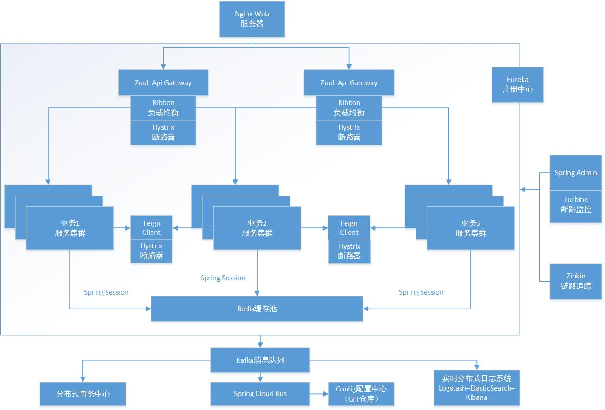


针对这个架构图我分层介绍一下：

1、是web服务器的选型，这个我选择的是nginx+keepalived，haproxy也是一个选择，但是haproxy在反向代理处理跨域访问的时候问题很多。所以我们nginx有些地方做了keep-alive模式处理，减少了三次握手的次数，提高了连接效率。keepalived做nginx的负载，虚拟一个vip对外，两个nginx做高可用，nginx本身反向代理zuul集群。

2、api gateway，这里的zuul很多人诟病，说是速度慢推荐直接用nginx，这里我还是推荐使用zuul的，毕竟zuul含有拦截器和反向代理，在权限管理、单点登录、用户认证时候还是很有用的，而且zuul自带ribbon负载均衡，如果你直接用nginx，还需要单独做一个feign或者ribbon层，用来做业务集群的负载层，毕竟直接把接口暴露给web服务器太危险了。这里zuul带有ribbon负载均衡和hystrix断路器，直接反向代理serviceId就可以代理整个集群了。

3、业务集群，这一层我有些项目是分两层的，就是上面加了一个负载层，下面是从service开始的，底层只是单纯的接口，controller是单独一层由feign实现，然后内部不同业务服务接口互调，直接调用controller层，只能说效果一般，多了一次tcp连接。所以我推荐合并起来，因为做过spring cloud项目的都知道，feign是含有ribbon的，而zuul也含有ribbon，这样的话zuul调用服务集群，和服务集群间接口的互调都是高可用的，保证了通讯的稳定性。Hystrix还是要有的，没有断路器很难实现服务降级，会出现大量请求发送到不可用的节点。当然service是可以改造的，如果改造成rpc方式，那服务之间互调又是另外一种情况了，那就要做成负载池和接口服务池的形式了，负载池调用接口池，接口池互相rpc调用，feign client只是通过实现接口达到了仿rpc的形式，不过速度表现还是不错的。

4、redis缓存池，这个用来做session共享，**分布式系统session共享是一个大问题**。同时呢，redis做二级缓存对降低整个服务的响应时间，并且减少数据库的访问次数是很有帮助的。当然redis cluster还是redis sentinel自己选择。

5、eurake注册中心这个高可用集群，这里有很多细节，比如多久刷新列表一次，多久监测心跳什么的，都很重要。

6、spring admin，这个是很推荐的，这个功能很强大，可以集成turbine断路器监控器，而且可以定义所有类的log等级，不用单独去配置，还可以查看本地log日志文件，监控不同服务的机器参数及性能，非常强大。它加上elk动态日志收集系统，对于项目运维非常方便。

7、zipkin，这个有两种方式，直接用它自己的功能界面查看方式，或者用stream流的方式，由elk动态日志系统收集。但是我必须要说，这个对系统的性能损害非常大，因为链路追踪的时候会造成响应等待，而且等待时间非常长接近1秒，这在生产环境是不能忍受的，所以生产环境最好关掉，有问题调试的时候再打开。

8、消息队列，这个必须的，**分布式系统不可能所有场景都满足强一致性**，这里只能由消息队列来作为缓冲，这里我用的是Kafka。

9、**分布式事物，我认为这是分布式最困难的**，因为不同的业务集群都对应自己的数据库，互相数据库不是互通的，互相服务调用只能是相互接口，有些甚至是异地的，这样造成的结果就是网络延迟造成的请求等待，网络抖动造成的数据丢失，这些都是很可怕的问题，所以必须要处理分布式事物。我推荐的是利用消息队列，采取二阶段提交协议配合事物补偿机制，具体的实现需要结合业务，这里篇幅有限就不展开说了。

10、config配置中心，这是很有必要的，因为服务太多配置文件太多，没有这个很难运维。这个一般利用消息队列建立一个spring cloud bus，由git存储配置文件，利用bus总线动态更新配置文件信息。

11、实时分布式日志系统，logstash收集本地的log文件流，传输给elasticsearch，logstash有两种方式，1、是每一台机器启动一个logstash服务，读取本地的日志文件，生成流传给elasticsearch。2、logback引入logstash包，然后直接生产json流传给一个中心的logstash服务器，它再传给elasticsearch。elasticsearch再将流传给kibana，动态查看日志，甚至zipkin的流也可以直接传给elasticsearch。这个配合spring admin，一个查看动态日志，一个查看本地日志，同时还能远程管理不同类的日志级别，对集成和运维非常有利。

最后要说说，spring cloud的很多东西都比较精确，比如断路器触发时间、事物补偿时间、http响应时间等，这些都需要好好的设计，而且可以优化的点非常多。比如：http通讯可以使用okhttp，jvm优化，nio模式，数据连接池等等，都可以很大的提高性能。

还有一个docker问题，很多人说不用docker就不算微服务。其实我个人意见，spring cloud本身就是微服务的，只需要jdk环境即可。编写dockerfile也无非是集成jdk、添加jar包、执行jar而已，或者用docker compose，将多个不同服务的image组合run成容器而已。但是带来的问题很多，比如通讯问题、服务器性能损耗问题、容器进程崩溃问题，当然如果你有一套成熟的基于k8s的容器管理平台，这个是没问题的，如果没有可能就要斟酌了。而spring cloud本身就是微服务分布式的架构，所以个人还是推荐直接机器部署的，当然好的DevOps工具将会方便很多。

作者：罗伯特_巴乔 
来源：CSDN 
原文：https://blog.csdn.net/cyc3552637/article/details/80254490 
版权声明：本文为博主原创文章，转载请附上博文链接！


## 开启SpringCloud之旅

### 一、Spring Cloud项目搭建

#### 1、建立父工程

​	首先创建一个父工程，名字为spring cloud打开IDEA（以下编码过程编码工具采用IDEA）。

创建新工程为Spring Cloud。

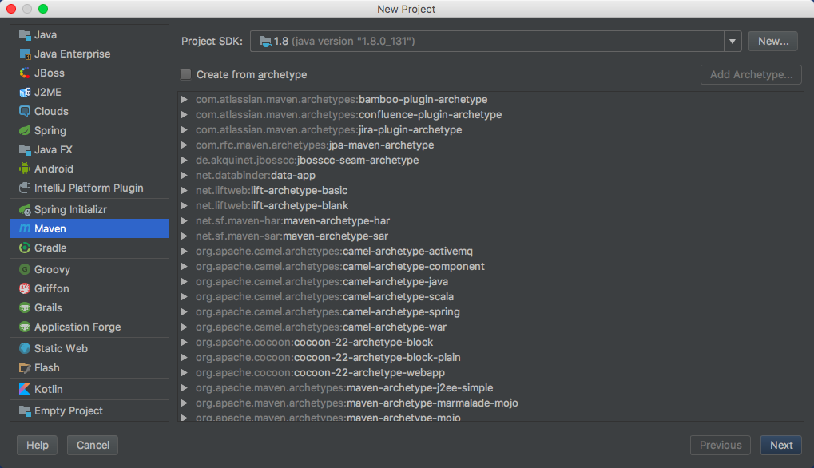

​	选择下一步

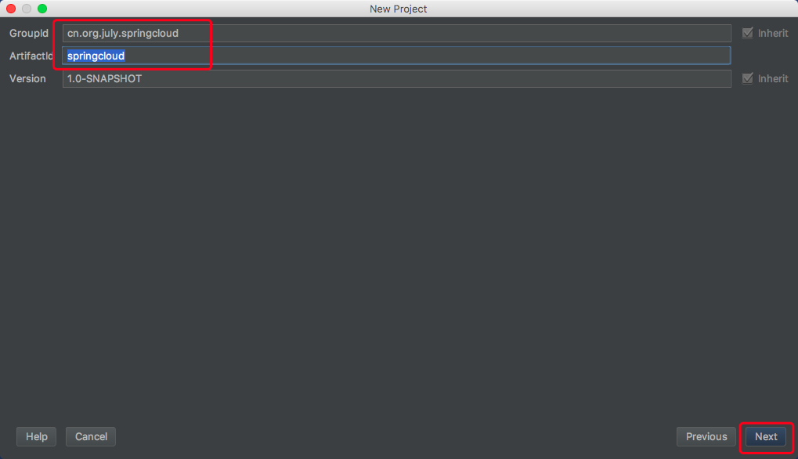


   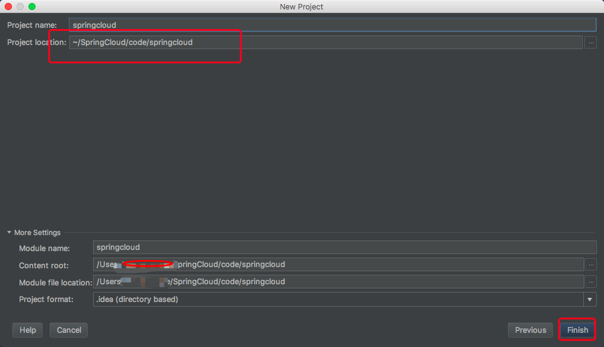

   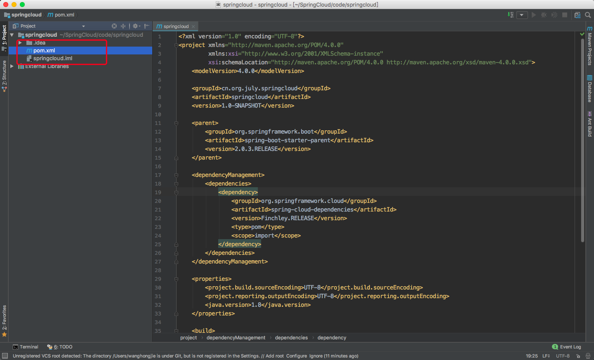

   引入pom.xml代码如下：

   ```xml
<?xml version="1.0" encoding="UTF-8"?>
<project xmlns="http://maven.apache.org/POM/4.0.0"
         xmlns:xsi="http://www.w3.org/2001/XMLSchema-instance"
         xsi:schemaLocation="http://maven.apache.org/POM/4.0.0 http://maven.apache.org/xsd/maven-4.0.0.xsd">
    <modelVersion>4.0.0</modelVersion>

    <groupId>cn.org.july.springcloud</groupId>
    <artifactId>springcloud</artifactId>
    <version>1.0-SNAPSHOT</version>
    <packaging>pom</packaging>


    <properties>
        <project.version>1.0-SNAPSHOT</project.version>
        <project.build.sourceEncoding>UTF-8</project.build.sourceEncoding>
        <project.reporting.outputEncoding>UTF-8</project.reporting.outputEncoding>
        <java.version>1.8</java.version>
        <lombok.version>1.16.18</lombok.version>
        <log4j.version>1.2.17</log4j.version>
        <junit.version>4.12</junit.version>
        <mysql.version>6.0.6</mysql.version>
        <druid.version>1.1.10</druid.version>
    </properties>

    <dependencyManagement>
        <dependencies>
            <dependency>
                <groupId>org.springframework.cloud</groupId>
                <artifactId>spring-cloud-dependencies</artifactId>
                <version>Finchley.SR2</version>
                <type>pom</type>
                <scope>import</scope>
            </dependency>

            <dependency>
                <groupId>org.springframework.boot</groupId>
                <artifactId>spring-boot-dependencies</artifactId>
                <version>2.0.6.RELEASE</version>
                <type>pom</type>
                <scope>import</scope>
            </dependency>

            <!-- mysql jdbc 驱动 -->
            <dependency>
                <groupId>mysql</groupId>
                <artifactId>mysql-connector-java</artifactId>
                <version>${mysql.version}</version>
            </dependency>
            <dependency>
                <groupId>com.alibaba</groupId>
                <artifactId>druid</artifactId>
                <version>${druid.version}</version>
            </dependency>
            <dependency>
                <groupId>org.mybatis.spring.boot</groupId>
                <artifactId>mybatis-spring-boot-starter</artifactId>
                <version>1.3.2</version>
            </dependency>
            <dependency>
                <groupId>ch.qos.logback</groupId>
                <artifactId>logback-core</artifactId>
                <version>1.2.3</version>
            </dependency>
            <dependency>
                <groupId>junit</groupId>
                <artifactId>junit</artifactId>
                <version>${junit.version}</version>
                <scope>test</scope>
            </dependency>
            <dependency>
                <groupId>log4j</groupId>
                <artifactId>log4j</artifactId>
                <version>${log4j.version}</version>
            </dependency>
        </dependencies>
    </dependencyManagement>

    <build>
        <plugins>
            <plugin>
                <groupId>org.apache.maven.plugins</groupId>
                <artifactId>maven-jar-plugin</artifactId>
            </plugin>
            <plugin>
                <artifactId>maven-site-plugin</artifactId>
                <version>2.3</version>
                <executions>
                    <execution>
                        <id>default-site</id>
                        <phase>site</phase>
                        <goals>
                            <goal>site</goal>
                        </goals>
                    </execution>
                </executions>
            </plugin>
            <plugin>
                <groupId>org.apache.maven.plugins</groupId>
                <artifactId>maven-deploy-plugin</artifactId>
                <version>2.8.2</version>
                <configuration>
                    <skip>true</skip>
                </configuration>
            </plugin>
        </plugins>
    </build>
</project>
   ```

​	该工程为父工程，打包方式为pom.`<packaging>pom</packaging>`

#### 2、建立服务API模块

​		在父工程中，新建`Module`,module名称为`springcloud-api`

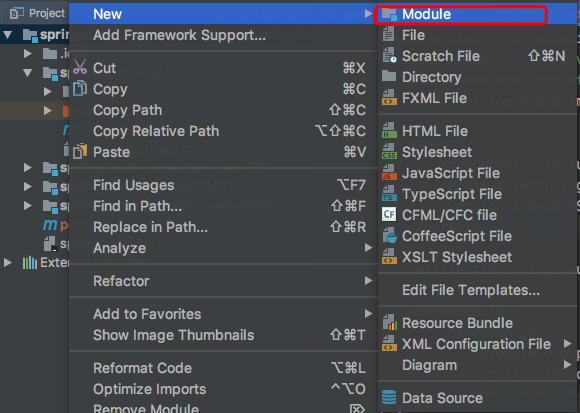

​	

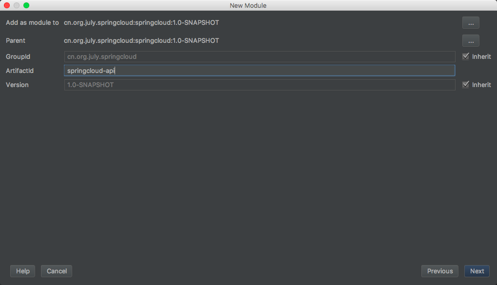


​	创建完成后项目结构如下：

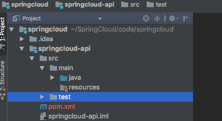

​	新建包`cn.org.july.springcloudapi.entities`

​	新建类`User`内容如下：

```java
@AllArgsConstructor
@NoArgsConstructor
@Data
@Accessors(chain = true)
public class User implements Serializable {
    /**
     * 主键
     */
    private Integer id;
    /**
     * 部门名称
     */
    private String userName;
    /**
     * 存储数据库位置（分布式部署可能存在多个数据库）
     */
    private String dbSource;
    /**
     * 电话号
     */
    private Spring phone;
    /**
     * 邮箱
     */
    private String email;
    /**
     * 密码
     */
    private String pwd;

}
```

说明：此次使用lombok插件；官网 https://www.projectlombok.org/

| 注解                                                         | 说明                                                         |
| ------------------------------------------------------------ | ------------------------------------------------------------ |
| @Data                                                        | 在JavaBean或类JavaBean中使用，这个注解包含范围最广，它包含getter、setter、NoArgsConstructor注解，即当使用当前注解时，会自动生成包含的所有方法； |
| @getter                                                      | 在JavaBean或类JavaBean中使用，使用此注解会生成对应的getter方法； |
| @setter                                                      | 在JavaBean或类JavaBean中使用，使用此注解会生成对应的setter方法； |
| @NoArgsConstructor                                           | 在JavaBean或类JavaBean中使用，使用此注解会生成对应的无参构造方法； |
| @AllArgsConstructor                                          | 在JavaBean或类JavaBean中使用，使用此注解会生成对应的有参构造方法； |
| @ToString                                                    | 在JavaBean或类JavaBean中使用，使用此注解会自动重写对应的toStirng方法； |
| @EqualsAndHashCode                                           | 在JavaBean或类JavaBean中使用，使用此注解会自动重写对应的equals方法和hashCode方法； |
| @Slf4j                                                       | 在需要打印日志的类中使用，当项目中使用了slf4j打印日志框架时使用该注解，会简化日志的打印流程，只需调用info方法即可； |
| @Log4j                                                       | 在需要打印日志的类中使用，当项目中使用了log4j打印日志框架时使用该注解，会简化日志的打印流程，只需调用info方法即可； |
| @Accessors(prefix = {"first"}, fluent = true, chain = false) | 与生存的get和set方法有关，prefix与定义属性前缀相同时且接下来的字符大写才生效，可以看源码注释或自行尝试；<br/>fluent是决定生成的get/set方法要不要set/get前缀，chain决定set方法是void类型还是返回this |


项目POM文件内容如下：

```xml
<?xml version="1.0" encoding="UTF-8"?>
<project xmlns="http://maven.apache.org/POM/4.0.0" xmlns:xsi="http://www.w3.org/2001/XMLSchema-instance"
	xsi:schemaLocation="http://maven.apache.org/POM/4.0.0 http://maven.apache.org/xsd/maven-4.0.0.xsd">
	<modelVersion>4.0.0</modelVersion>

	<parent>
		<groupId>cn.org.july.springcloud</groupId>
		<artifactId>springcloud</artifactId>
		<version>1.0-SNAPSHOT</version>
	</parent>

	<artifactId>springcloud-api</artifactId>

	<dependencies>
		<dependency>
			<groupId>org.projectlombok</groupId>
			<artifactId>lombok</artifactId>
			<version>1.16.18</version>
		</dependency>
	</dependencies>
</project>

```

```java
@AllArgsConstructor
@NoArgsConstructor
@Data
@Accessors(chain = true)
public class User implements Serializable {
    /**
     * 主键
     */
    private Integer id;
    /**
     * 部门名称
     */
    private String userName;
    /**
     * 存储数据库位置（分布式部署可能存在多个数据库）
     */
    private String dbSource;
    /**
     * 电话号
     */
    private Spring phone;
    /**
     * 邮箱
     */
    private String email;
    /**
     * 密码
     */
    private String pwd;

}
```


#### 3、建立服务提供者

​		在父工程中，新建`Module`,module名称为`springcloud-provider-user-8001`。

​	创建过程如上，不再截图。

修改该`Module ` pom.xml文件，内容如下：

```xml
<?xml version="1.0" encoding="UTF-8"?>
<project xmlns="http://maven.apache.org/POM/4.0.0"
         xmlns:xsi="http://www.w3.org/2001/XMLSchema-instance"
         xsi:schemaLocation="http://maven.apache.org/POM/4.0.0 http://maven.apache.org/xsd/maven-4.0.0.xsd">
    <parent>
        <artifactId>springcloud</artifactId>
        <groupId>cn.org.july.springcloud</groupId>
        <version>1.0-SNAPSHOT</version>
    </parent>
    <modelVersion>4.0.0</modelVersion>

    <artifactId>springcloud-provider-user-8001</artifactId>
    <dependencies>
        <!-- 引入API -->
        <dependency>
            <groupId>cn.org.july.springcloud</groupId>
            <artifactId>springcloud-api</artifactId>
            <version>${project.version}</version>
        </dependency>
        <!-- 单元测试 -->
        <dependency>
            <groupId>junit</groupId>
            <artifactId>junit</artifactId>
        </dependency>
        <!-- 数据源 -->
        <dependency>
            <groupId>com.alibaba</groupId>
            <artifactId>druid</artifactId>
        </dependency>
        <!-- 数据库驱动-->
        <dependency>
            <groupId>mysql</groupId>
            <artifactId>mysql-connector-java</artifactId>
        </dependency>
        <!-- 日志 -->
        <dependency>
            <groupId>ch.qos.logback</groupId>
            <artifactId>logback-core</artifactId>
        </dependency>
        <!-- springBoot 集成 mybatis-->
        <dependency>
            <groupId>org.mybatis.spring.boot</groupId>
            <artifactId>mybatis-spring-boot-starter</artifactId>
        </dependency>
        <!-- web模块 -->
        <dependency>
            <groupId>org.springframework.boot</groupId>
            <artifactId>spring-boot-starter-web</artifactId>
        </dependency>
        <!-- 单元测试 -->
        <dependency>
            <groupId>org.springframework.boot</groupId>
            <artifactId>spring-boot-starter-test</artifactId>
        </dependency>
    </dependencies>

</project>
```

我们这里主要是讲整体架构搭建，我们不具体实现复杂的业务逻辑。**以下只实现查询接口**。

在新建的Module中建立如下项目结构：

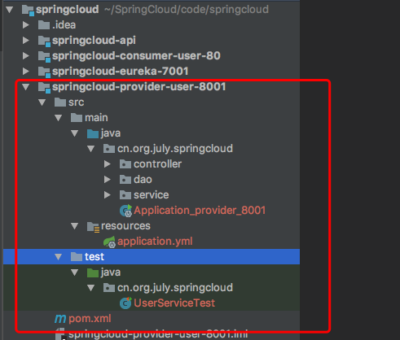

- 新建包路径`cn.org.july.springcloud.dao;cn.org.july.springcloud.service;cn.org.july.springcloud.controller;`。

- 在`resources`目录下创建`application.yml`配置文件。

  ```yaml
  xserver:
    port: 8001
  mybatis:
    type-aliases-package:  cn.org.july.springcloudapi.entities       #所以entity别名类所在路径
  
  spring:
    application:
      name: springcloud-user
    datasource:
      type: com.alibaba.druid.pool.DruidDataSource                   #当前数据源操作类型
      driver-class-name: com.mysql.cj.jdbc.Driver                    #mysql驱动包
      url: jdbc:mysql://127.0.0.1:3306/cloudDB01                     #数据库连接
      username: root
      password: xxxx
      dbcp2:
        min-idle: 5                                                   #数据库连接池的最小维持连接数
        initial-size: 5                                               #初始化连接数
        max-total: 5                                                  #最大连接数
        max-wait-millis: 200                                          #等待连接获取的最大超时时间
  
  ```

  **注意**：

  ```yaml
  spring:
    application:
      name: springcloud-user
  ```

- 新建数据库**cloudDB01**执行以下脚本

  ```sql
  /*
   Navicat MySQL Data Transfer
  
   Source Server         : localhost
   Source Server Type    : MySQL
   Source Server Version : 50719
   Source Host           : localhost
   Source Database       : cloudDB01
  
   Target Server Type    : MySQL
   Target Server Version : 50719
   File Encoding         : utf-8
  
   Date: 11/18/2018 14:19:42 PM
  */
  
  SET NAMES utf8;
  SET FOREIGN_KEY_CHECKS = 0;
  
  -- ----------------------------
  --  Table structure for `user`
  -- ----------------------------
  DROP TABLE IF EXISTS `user`;
  CREATE TABLE `user` (
    `id` int(11) NOT NULL AUTO_INCREMENT,
    `userName` varchar(50) DEFAULT NULL,
    `dbSource` varchar(50) DEFAULT NULL,
    `phone` varchar(20) DEFAULT NULL,
    `email` varchar(50) DEFAULT NULL,
    `pwd` varchar(50) DEFAULT NULL,
    PRIMARY KEY (`id`)
  ) ENGINE=InnoDB AUTO_INCREMENT=3 DEFAULT CHARSET=latin1;
  
  -- ----------------------------
  --  Records of `user_copy`
  -- ----------------------------
  BEGIN;
  INSERT INTO `user` VALUES ('1', 'JULY', 'cloudDB01', '18232533234', 'july@163.com', '123456'), ('2', 'WHJ', 'cloudDB01', '12312312312', '123@qq.com', '123456');
  COMMIT;
  
  SET FOREIGN_KEY_CHECKS = 1;
  ```

- 在dao中新建类：`UserDao`.内容如下：

  ```java
  @Mapper
  public interface UserDao {
  
      @Select("select * from user")
      List<User> findAll();
  
      @Select("select * from user where id = #{id}")
      User findById(Long id);
  
  }
  ```

- 在service中新建类：`UserService`。内容如下：

  ```java
  @Service
  public class UserService {
  
      @Autowired
      private UserDao userDao;
  
      public User findById(Long id) {
          return userDao.findById(id);
      }
  
      public List<User> findAll() {
          return userDao.findAll();
      }
  }
  ```

- 在controller中新建类：`UserController`。内容如下：

  ```java
  @RestController
  @RequestMapping
  public class UserController {
      @Autowired
      private UserService userService;
  
      @RequestMapping(value = "/user/all")
      @ResponseBody
      public List<User> getAllUser(){
          return userService.findAll();
      }
      
      @RequestMapping(value = "/user/{id}")
      @ResponseBody
      public User getUserById(@PathVariable("id") Long id){
          return userService.findById(id);
      }
  }
  
  ```

- 创建服务启动类`Application_provider_8001`。内容如下：

  ```java
  @SpringBootApplication
  @MapperScan(basePackages = "cn.org.july.springcloud")
  public class Application_provider_8001 {
      public static void main(String[] args) {
          SpringApplication.run(Application_provider_8001.class, args);
      }
  }
  ```

- 启动后在浏览器中输入http://localhost:8001/user/all;返回内容如下，说明服务提供者搭建成功。

  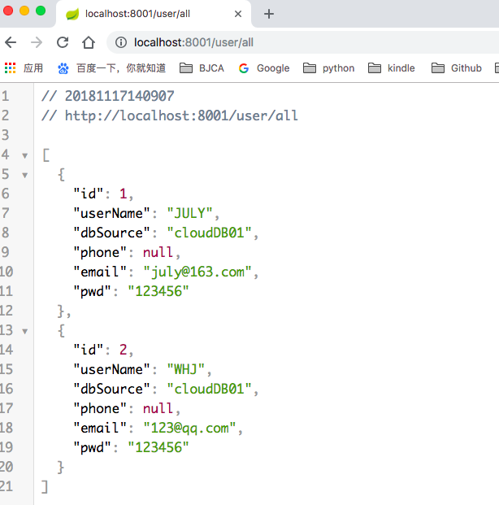


#### 4、创建服务消费者

​	新建`Module`,名称为`springcloud-consumer-user-8000`。

创建过来不在详细讲述；创建完成后，项目结构目录如下：

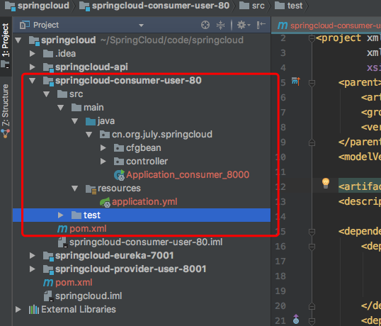

- 在`springcloud-consumer-user-8000`中，新建包结构，`cn.org.july.springcloud.cfgbean;cn.org.july.springcloud.controller`.

- 在`resources`目录新建`application.yml`配置文件

  ```yaml
  server:
    port: 8000
  ```

  作为服务消费者，只需要指定服务端口即可。

- 在`cn.org.july.springcloud.cfgbean`包创建`ConfigBean`.内容如下：

  ```java
  @Configuration
  public class ConfigBean {
      @Bean
      public RestTemplate getRestTemplate(){
          return new RestTemplate();
      }
  }
  ```

  关于这两个注解，笔者在Spring Boot 中已经详细讲解过，有想了解，提供传送门；https://blog.csdn.net/July_whj/article/details/83449911

  **RestTemplate**： RestTemplate 提供了多种便捷访问远程HTTP服务的方法，是一种简单便捷的访问restful服务模版类，是Spring提供的用于访问Rest服务的客户端模版工具集。详情查看官方网站 https://docs.spring.io/spring/docs/current/javadoc-api/org/springframework/web/client/RestTemplate.html

- 在`controller`中新建`UserController_Consumer`类。（这里命名有点怪。。。）

  ```java
  @RestController
  public class UserController_Consumer {
  	/**
  	 * 服务提供方地址
  	 */
      private static final String url = "http://localhost:8001/";
  
      /**
       * RestTemplate 提供了多种便捷访问远程HTTP服务的方法
       * 是一种简单便捷的访问restful服务模版类，是Spring提供的用于访问
       * Rest服务的客户端模版工具集
       */
      @Autowired
      private RestTemplate restTemplate;
  
      @RequestMapping(value = "/consumer/user/all")
      @ResponseBody
      public List getUserAll() {
          return restTemplate.getForObject(url.concat("user/all"), List.class);
      }
  
      @RequestMapping(value = "/consumer/user/{id}")
      @ResponseBody
      public ResponseEntity<User> getUserById(@PathVariable("id") Long id) {
          return restTemplate.getForEntity(url.concat("user/").concat(id.toString()), User.class);
      }
  
  }
  ```

  这里和服务提供者的区别访问地址新增`consumer`路径。

- 创建服务启动类`Application_consumer_8000`,内容如下：

  ```java
  @SpringBootApplication
  public class Application_consumer_8000 {
      public static void main(String[] args) {
          SpringApplication.run(Application_consumer_8000.class, args);
      }
  }
  ```

- 首先启动服务提供者服务`springcloud-provider-user-8001`,在启动服务消费者`springcloud-consumer-user-8000`.服务启动成功后访问 http://localhost:8000/consumer/user/1；http://localhost:8000/consumer/user/all

  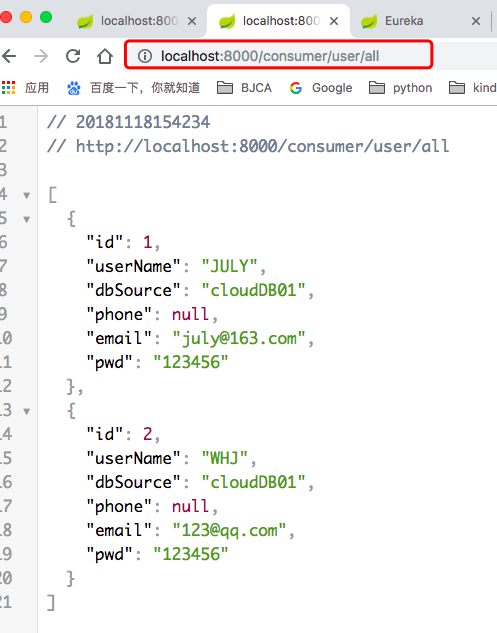

  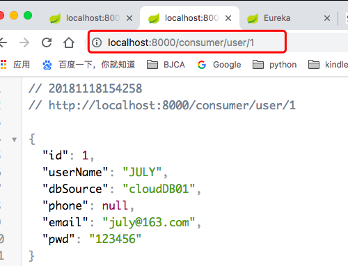

  出现以上结果，服务消费者配置成功。该程序只做简单实例。

### 二 、Eureka服务注册与发现

#### 1、服务的注册与发现

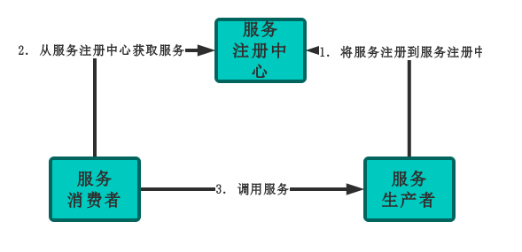

关系调用说明：

- 服务生产者启动时，向服务注册中心注册自己提供的服务

- 服务消费者启动时，在服务注册中心订阅自己所需要的服务

- 注册中心返回服务提供者的地址信息个消费者

- 消费者从提供者中调用服务


#### 2、启动eureka注册中心

​	Eureka是Spring Cloud Netflix微服务套件中的一部分，可以与Springboot构建的微服务很容易的整合起来。
​	Eureka包含了服务器端和客户端组件。服务器端，也被称作是服务注册中心，用于提供服务的注册与发现。

​	Eureka支持高可用的配置，当集群中有分片出现故障时，Eureka就会转入自动保护模式，它允许分片故障期间继续提供服务的发现和注册，当故障分片恢复正常时，集群中其他分片会把他们的状态再次同步回来。
​	客户端组件包含服务消费者与服务生产者。在应用程序运行时，Eureka客户端向注册中心注册自身提供的服务并周期性的发送心跳来更新它的服务租约。同时也可以从服务端查询当前注册的服务信息并把他们缓存到本地并周期性的刷新服务状态。


- 新创建一个`Module`,命名为`springcloud-eureka-7001`,项目结构如下：

  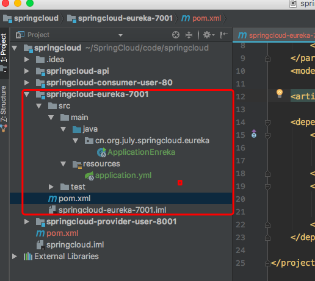

- 修改pom.xml文件

  ```xml
  <?xml version="1.0" encoding="UTF-8"?>
  <project xmlns="http://maven.apache.org/POM/4.0.0"
           xmlns:xsi="http://www.w3.org/2001/XMLSchema-instance"
           xsi:schemaLocation="http://maven.apache.org/POM/4.0.0 http://maven.apache.org/xsd/maven-4.0.0.xsd">
      <parent>
          <artifactId>springcloud</artifactId>
          <groupId>cn.org.july.springcloud</groupId>
          <version>1.0-SNAPSHOT</version>
      </parent>
      <modelVersion>4.0.0</modelVersion>
  
      <artifactId>springcloud-eureka-7001</artifactId>
  
      <dependencies>
          <dependency>
              <groupId>org.springframework.boot</groupId>
              <artifactId>spring-boot-starter-web</artifactId>
          </dependency>
          <!--注意：这里是服务注册中心，需要引入eureka的服务端 -->
          <dependency>
              <groupId>org.springframework.cloud</groupId>
              <artifactId>spring-cloud-starter-netflix-eureka-server</artifactId>
          </dependency>
      </dependencies>
  </project>
  ```

- 在`resources`目录下新建`application.yml`,文件，内容如下：

  ```yacas
  server:
    port: 7001
  
  eureka:
    instance:
      hostname: localhost
    client:
      registerWithEureka: false
      fetchRegistry: false
      serviceUrl:
        defaultZone: http://${eureka.instance.hostname}:${server.port}/eureka/
  
  spring:
    application:
      name: eurka-server
  ```

- 创建包`cn.org.july.springcloud.eureka`,创建系统启动类`ApplicationEnreka`，

  ```java
  @SpringBootApplication
  @EnableEurekaServer
  public class ApplicationEnreka {
  
      public static void main(String[] args) {
          SpringApplication.run(ApplicationEnreka.class, args);
      }
  
  }
  ```

  注意：启动类上需标明该类是Eureka服务端。

- 启动后访问http://localhost:7001/ 出现如下页面服务注册中心搭建成功。

  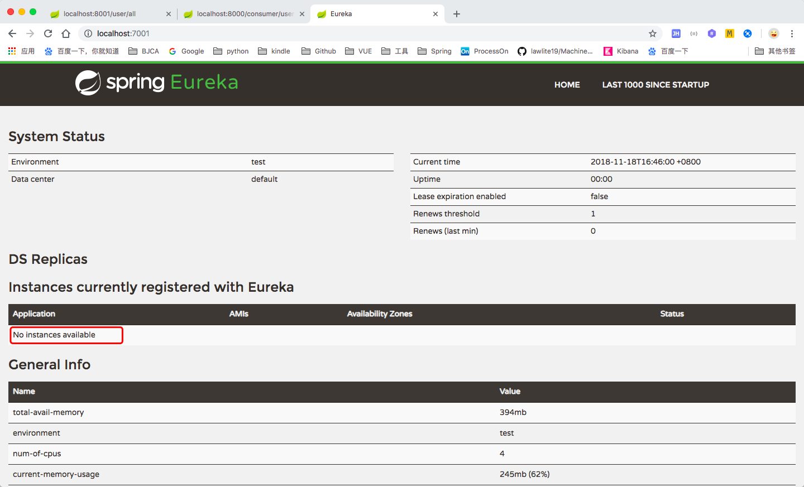

  **注意**：标注红的的框框是 **No instances available** ，表示没有实例注册到该服务的注册中上。

  

过一段时间，不操作，刷新页面会看到一段红色的描述。这个不是错误，是Eureka的自我保护。后面我们详细讲解。

#### 3、将用户微服务注入Eureka注册中心

##### 3.1、修改用户微服务

**pom修改**

在原有pom.xml基础上新增一下内容：

```xml
<!-- 将微服务provider侧注册进eureka -->
<dependency>
   <groupId>org.springframework.cloud</groupId>
   <artifactId>spring-cloud-starter-netflix-eureka-client</artifactId>
</dependency>
```

修改后pom.xml全部内容:

```xml
<?xml version="1.0" encoding="UTF-8"?>
<project xmlns="http://maven.apache.org/POM/4.0.0"
         xmlns:xsi="http://www.w3.org/2001/XMLSchema-instance"
         xsi:schemaLocation="http://maven.apache.org/POM/4.0.0 http://maven.apache.org/xsd/maven-4.0.0.xsd">
    <parent>
        <artifactId>springcloud</artifactId>
        <groupId>cn.org.july.springcloud</groupId>
        <version>1.0-SNAPSHOT</version>
    </parent>
    <modelVersion>4.0.0</modelVersion>

    <artifactId>springcloud-provider-user-8001</artifactId>
    <dependencies>
        <!-- 引入API -->
        <dependency>
            <groupId>cn.org.july.springcloud</groupId>
            <artifactId>springcloud-api</artifactId>
            <version>${project.version}</version>
        </dependency>
        <!-- 单元测试 -->
        <dependency>
            <groupId>junit</groupId>
            <artifactId>junit</artifactId>
        </dependency>
        <!-- 数据源 -->
        <dependency>
            <groupId>com.alibaba</groupId>
            <artifactId>druid</artifactId>
        </dependency>
        <!-- 数据库驱动-->
        <dependency>
            <groupId>mysql</groupId>
            <artifactId>mysql-connector-java</artifactId>
        </dependency>
        <!-- 日志 -->
        <dependency>
            <groupId>ch.qos.logback</groupId>
            <artifactId>logback-core</artifactId>
        </dependency>
        <!-- springBoot 集成 mybatis-->
        <dependency>
            <groupId>org.mybatis.spring.boot</groupId>
            <artifactId>mybatis-spring-boot-starter</artifactId>
        </dependency>
        <!-- web模块 -->
        <dependency>
            <groupId>org.springframework.boot</groupId>
            <artifactId>spring-boot-starter-web</artifactId>
        </dependency>
        <!-- 单元测试 -->
        <dependency>
            <groupId>org.springframework.boot</groupId>
            <artifactId>spring-boot-starter-test</artifactId>
        </dependency>

        <!-- 将微服务provider侧注册进eureka -->
        <dependency>
            <groupId>org.springframework.cloud</groupId>
            <artifactId>spring-cloud-starter-netflix-eureka-client</artifactId>
        </dependency>
    </dependencies>
</project>
```

**YML修改**

在原`application.yml`基础上新增一下内容：

```yaml
eureka:
  client:
    serviceUrl:
      defaultZone: http://localhost:7001/eureka/
      registerWithEureka: true
      fetchRegistry: true
```

修改后全yml文件内容如下：

```yaml
server:
  port: 8001
mybatis:
  type-aliases-package:  cn.org.july.springcloudapi.entities            #所以entity别名类所在路径

spring:
  application:
    name: springcloud-user
  datasource:
    type: com.alibaba.druid.pool.DruidDataSource                        #当前数据源操作类型
    driver-class-name: com.mysql.cj.jdbc.Driver                         #mysql驱动包
    url: jdbc:mysql://127.0.0.1:3306/cloudDB01?useUnicode=true&characterEncoding=utf8&serverTimezone=GMT%2B8&useSSL=false                          #数据库连接
    username: root
    password: root
    dbcp2:
      min-idle: 5                                                       #数据库连接池的最小维持连接数
      initial-size: 5                                                   #初始化连接数
      max-total: 5                                                      #最大连接数
      max-wait-millis: 200                                              #等待连接获取的最大超时时间

eureka:
  client:
    serviceUrl:
      defaultZone: http://localhost:7001/eureka/
      registerWithEureka: true
      fetchRegistry: true

```

程序启动类Application_provider_8001修改：

在`Application_provider_8001`类中新增注解`@EnableEurekaClient`,

修改后信息如下：

```java
@SpringBootApplication
@EnableEurekaClient //本服务启动后会自动注册进eureka服务中
@MapperScan(basePackages = "cn.org.july.springcloud")
public class Application_provider_8001 {
    public static void main(String[] args) {
        SpringApplication.run(Application_provider_8001.class, args);
    }
}
```

##### 3.2、测试服务注入

1、首先启动Eureka服务。

2、启动用户微服务。

3、在浏览器中打开http://127.0.0.1:7001.

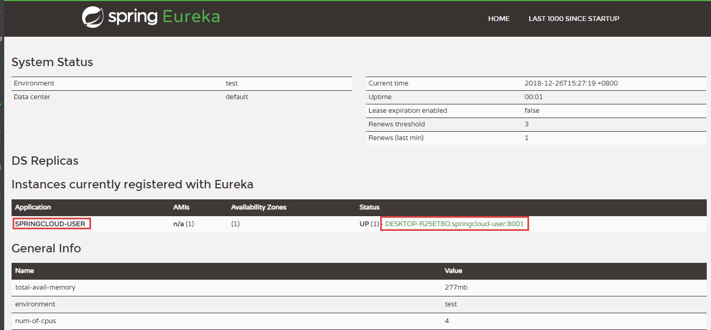

可以看到，用户微服务注册成功。

Application 名称对应配置关系如下：

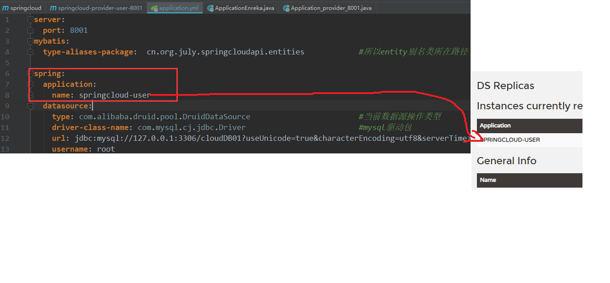 

##### 3.3、注册微服务信息完善

问题：

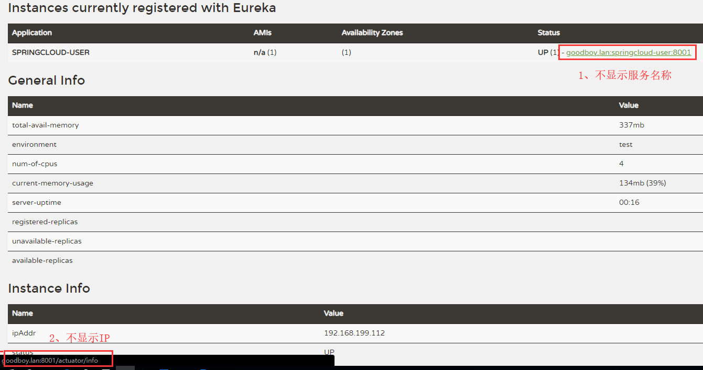

1、修复 问题一 不显示服务名称问题:

​	修改`springcloud-provider-user-8001`服务中的yml文件，新增 `instance-id: springcloud-user-8001` 重新启动服务，问题修改完成。

```yaml
eureka:
  client:
    serviceUrl:
      defaultZone: http://eureka7001.com:7001/eureka/,http://eureka7002.com:7002/eureka/,http://eureka7003.com:7003/eureka/
      registerWithEureka: true
      fetchRegistry: true
  instance:
    instance-id: springcloud-user-8001
```

2、修复问题二 不显示Ip地址：

​	修改`springcloud-provider-user-8001` 服务yml文件，新增 `prefer-ip-address: true` 节点，全部内容如下：

```yaml
eureka:
  client:
    serviceUrl:
      defaultZone: http://eureka7001.com:7001/eureka/,http://eureka7002.com:7002/eureka/,http://eureka7003.com:7003/eureka/
      registerWithEureka: true
      fetchRegistry: true
  instance:
    instance-id: springcloud-user-8001
    prefer-ip-address: true
```

重启服务，问题修改完成。

3、点击服务名称，页面跳转404页面。

​	修复方案如下：

​	a、修改`springcloud-provider-user-8001`服务pom文件新增如下内容：

```xaml
<dependency>
     <groupId>org.springframework.boot</groupId>
     <artifactId>spring-boot-starter-actuator</artifactId>
</dependency>
```

​	完整pom文件

```xml
<?xml version="1.0" encoding="UTF-8"?>
<project xmlns="http://maven.apache.org/POM/4.0.0"
         xmlns:xsi="http://www.w3.org/2001/XMLSchema-instance"
         xsi:schemaLocation="http://maven.apache.org/POM/4.0.0 http://maven.apache.org/xsd/maven-4.0.0.xsd">
    <parent>
        <artifactId>springcloud</artifactId>
        <groupId>cn.org.july.springcloud</groupId>
        <version>1.0-SNAPSHOT</version>
    </parent>
    <modelVersion>4.0.0</modelVersion>

    <artifactId>springcloud-provider-user-8001</artifactId>
    <dependencies>
        <!-- 引入API -->
        <dependency>
            <groupId>cn.org.july.springcloud</groupId>
            <artifactId>springcloud-api</artifactId>
            <version>${project.version}</version>
        </dependency>
        <!-- 单元测试 -->
        <dependency>
            <groupId>junit</groupId>
            <artifactId>junit</artifactId>
        </dependency>
        <!-- 数据源 -->
        <dependency>
            <groupId>com.alibaba</groupId>
            <artifactId>druid</artifactId>
        </dependency>
        <!-- 数据库驱动-->
        <dependency>
            <groupId>mysql</groupId>
            <artifactId>mysql-connector-java</artifactId>
        </dependency>
        <!-- 日志 -->
        <dependency>
            <groupId>ch.qos.logback</groupId>
            <artifactId>logback-core</artifactId>
        </dependency>
        <!-- springBoot 集成 mybatis-->
        <dependency>
            <groupId>org.mybatis.spring.boot</groupId>
            <artifactId>mybatis-spring-boot-starter</artifactId>
        </dependency>
        <!-- web模块 -->
        <dependency>
            <groupId>org.springframework.boot</groupId>
            <artifactId>spring-boot-starter-web</artifactId>
        </dependency>
        <!-- 单元测试 -->
        <dependency>
            <groupId>org.springframework.boot</groupId>
            <artifactId>spring-boot-starter-test</artifactId>
        </dependency>

        <!-- actuator监控信息完善 -->
        <dependency>
            <groupId>org.springframework.boot</groupId>
            <artifactId>spring-boot-starter-actuator</artifactId>
        </dependency>
        <!-- 将微服务provider侧注册进eureka -->
        <dependency>
            <groupId>org.springframework.cloud</groupId>
            <artifactId>spring-cloud-starter-netflix-eureka-client</artifactId>
        </dependency>

    </dependencies>

</project>
```

​	b、修改`springcloud-provider-user-8001` yml文件修改内容如下：新增info节点

```yaml
info:
  app.name: springcloud-user
  company.name: www.july.com
  build.artifactId: springcloud
  build.version: 1.0-SNAPSHOT
```

完整yml文件如下：

```yaml
server:
  port: 8001
mybatis:
  type-aliases-package:  cn.org.july.springcloudapi.entities            #所以entity别名类所在路径

spring:
  application:
    name: springcloud-user
  datasource:
    type: com.alibaba.druid.pool.DruidDataSource                        #当前数据源操作类型
    driver-class-name: com.mysql.cj.jdbc.Driver                         #mysql驱动包
    url: jdbc:mysql://127.0.0.1:3306/cloudDB01?useUnicode=true&characterEncoding=utf8&serverTimezone=GMT%2B8&useSSL=false                          #数据库连接
    username: root
    password: root
    dbcp2:
      min-idle: 5                                                       #数据库连接池的最小维持连接数
      initial-size: 5                                                   #初始化连接数
      max-total: 5                                                      #最大连接数
      max-wait-millis: 200                                              #等待连接获取的最大超时时间

eureka:
  client:
    serviceUrl:
      defaultZone: http://eureka7001.com:7001/eureka/,http://eureka7002.com:7002/eureka/,http://eureka7003.com:7003/eureka/
      registerWithEureka: true
      fetchRegistry: true
  instance:
    instance-id: springcloud-user-8001
    prefer-ip-address: true

info:
  app.name: springcloud-user
  company.name: www.july.com
  build.artifactId: springcloud
  build.version: 1.0-SNAPSHOT
```

问题修复完成，看下修改效果：

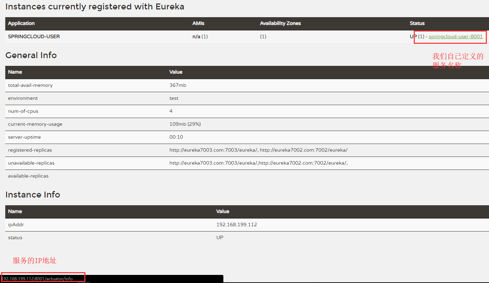

点击服务名称，显示我们自己定义的服务信息。

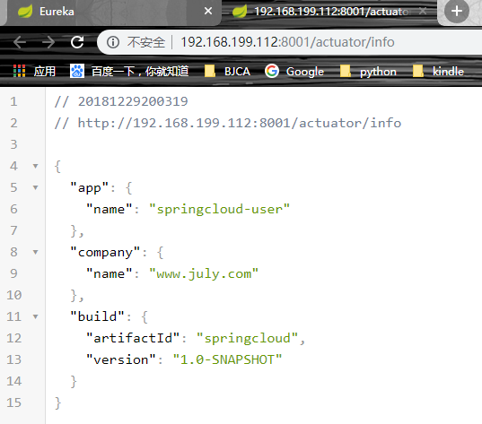

#### 4、Eureka集群搭建

CAP原则(CAP定理)： 
CAP原则又称CAP定理，指的是在一个分布式系统中， Consistency（一致性）、 Availability（可用性）、Partition tolerance（分区容错性），三者不可得兼。 
CAP原则是NOSQL数据库的基石。Consistency（一致性）。 Availability（可用性）。Partition tolerance（分区容错性）。 
分布式系统的CAP理论：理论首先把分布式系统中的三个特性进行了如下归纳： 
一致性（C）：在分布式系统中的所有数据备份，在同一时刻是否同样的值。（等同于所有节点访问同一份最新的数据副本） 
可用性（A）：在集群中一部分节点故障后，集群整体是否还能响应客户端的读写请求。（对数据更新具备高可用性） 

分区容忍性（P）：以实际效果而言，分区相当于对通信的时限要求。系统如果不能在时限内达成数据一致性，就意味着发生了分区的情况，必须就当前操作在C和A之间做出选择。 

##### 4.1、集群搭建

​	新建`springcloud-eureka-7002,`springcloud-eureka-7003`服务。copy  `springcloud-eureka-7001`中配置。修改服务启动端口分别为7002，7003。修改系统主启动类。

修改内容如下：

​	**系统启动类**：

​	`springcloud-eureka-7001`

```java
@SpringBootApplication
@EnableEurekaServer
public class ApplicationEureka7001 {
    public static void main(String[] args) {
        SpringApplication.run(ApplicationEureka7001.class, args);
    }
}
```

​	`springcloud-eureka-7002`

```java
@SpringBootApplication
@EnableEurekaServer
public class ApplicationEureka7002 {
    public static void main(String[] args) {
        SpringApplication.run(ApplicationEureka7002.class, args);
    }
}
```

​	`springcloud-eureka-7003`

```java
@SpringBootApplication
@EnableEurekaServer
public class ApplicationEureka7003 {

    public static void main(String[] args) {
        SpringApplication.run(ApplicationEureka7003.class, args);
    }
}
```

##### 4.2、修改映射配置

修改系统hosts文件

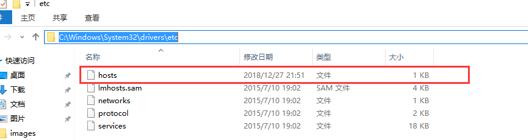

新增如下信息：

```xml
127.0.0.1 eureka7001.com
127.0.0.1 eureka7002.com
127.0.0.1 eureka7003.com
```

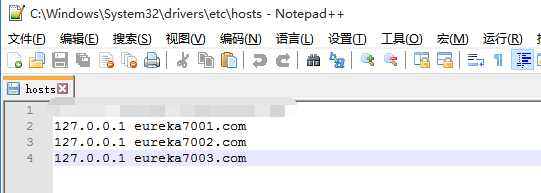

##### 4.3、修改服务配置yml

​	`springcloud-eureka-7001`

```yaml
server:
  port: 7001

eureka:
  instance:
    hostname: localhost
  client:
    registerWithEureka: false
    fetchRegistry: false
    serviceUrl:
      defaultZone: http://eureka7002.com:7002/eureka/,http://eureka7003.com:7003/eureka/  # 单点http://${eureka.instance.hostname}:${server.port}/eureka/
      
spring:
  application:
    name: eurka-server
```

​	`springcloud-eureka-7002`

```yaml
server:
  port: 7002

eureka:
  instance:
    hostname: eureka7002.com
  client:
    registerWithEureka: false
    fetchRegistry: false
    serviceUrl:
      defaultZone: http://eureka7001.com:7001/eureka/,http://eureka7003.com:7003/eureka/  # 单点http://${eureka.instance.hostname}:${server.port}/eureka/

spring:
  application:
    name: eurka-server
```

​	`springcloud-eureka-7003`

```yaml
server:
  port: 7003

eureka:
  instance:
    hostname: localhost
  client:
    registerWithEureka: false
    fetchRegistry: false
    serviceUrl:
      defaultZone: http://eureka7001.com:7001/eureka/,http://eureka7002.com:7002/eureka/  # 单点http://${eureka.instance.hostname}:${server.port}/eureka/

spring:
  application:
    name: eurka-server
```

##### 4.4、修改服务提供者`springcloud-provider-user-8001`配置

​	将之前单点连接替换成集群地址，完整yml文件如下：

```yaml
server:
  port: 8001
mybatis:
  type-aliases-package:  cn.org.july.springcloudapi.entities            #所以entity别名类所在路径

spring:
  application:
    name: springcloud-user
  datasource:
    type: com.alibaba.druid.pool.DruidDataSource                        #当前数据源操作类型
    driver-class-name: com.mysql.cj.jdbc.Driver                         #mysql驱动包
    url: jdbc:mysql://127.0.0.1:3306/cloudDB01?useUnicode=true&characterEncoding=utf8&serverTimezone=GMT%2B8&useSSL=false                          #数据库连接
    username: root
    password: root
    dbcp2:
      min-idle: 5                                                       #数据库连接池的最小维持连接数
      initial-size: 5                                                   #初始化连接数
      max-total: 5                                                      #最大连接数
      max-wait-millis: 200                                              #等待连接获取的最大超时时间

eureka:
  client:
    serviceUrl:
      defaultZone: http://eureka7001.com:7001/eureka/,http://eureka7002.com:7002/eureka/,http://eureka7003.com:7003/eureka/
      registerWithEureka: true
      fetchRegistry: true
  instance:
    instance-id: springcloud-user-8001
    prefer-ip-address: true

info:
  app.name: springcloud-user
  company.name: www.july.com
  build.artifactId: springcloud
  build.version: 1.0-SNAPSHOT
```

启动Eureka服务，启动服务提供者服务，在浏览器中输入 http://127.0.0.1:7001

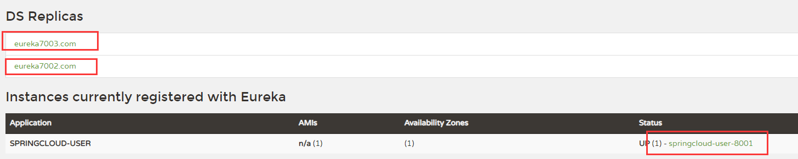

访问http://127.0.0.1:7002

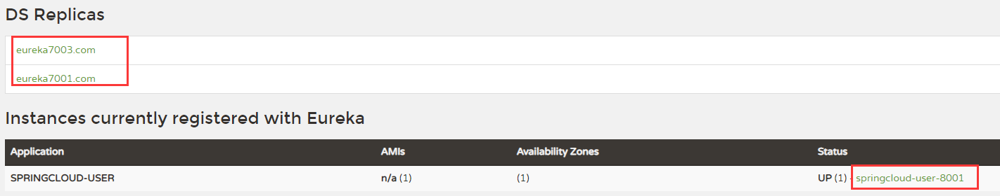

访问 http://127.0.0.1:7003

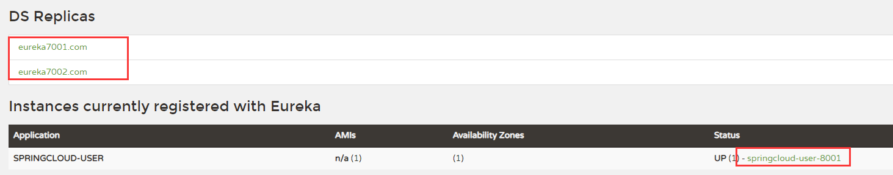

​	我们可以看到，访问任一节点都可以看到微服务`springcloud-provider-user-8001` 注册成功，并Eureka关联另外两个节点信息。故我们的eureka集群搭建成功。

###  三、Ribbon负载均衡

​	Spring Cloud Ribbon是基于Netflix Ribbon实现的一套**客户端**负载均衡的工具。

​	简单的说，Ribbon是Netflix发布的开源项目，主要功能是提供客户端的软件负载均衡算法，将Netflix的中间层服务连接在一起。Ribbon客户端组件提供一系列完善的配置项如连接超时，重试等。简单的说，就是在配置文件中列出Load Balancer（简称LB）后面所有的机器，Ribbon会自动的帮助你基于某种规则（如简单轮询，随机连接等）去连接这些机器。我们也很容易使用Ribbon实现自定义的负载均衡算法。、

​	LB，即负载均衡(Load Balance)，在微服务或分布式集群中经常用的一种应用。
​	负载均衡简单的说就是将用户的请求平摊的分配到多个服务上，从而达到系统的HA。
​	常见的负载均衡有软件Nginx，LVS，硬件 F5等。
​	相应的在中间件，例如：dubbo和SpringCloud中均给我们提供了负载均衡，SpringCloud的负载均衡算法可以自定义。

**集中式LB**

​	即在服务的消费方和提供方之间使用独立的LB设施(可以是硬件，如F5, 也可以是软件，如nginx), 由该设施负责把访问请求通过某种策略转发至服务的提供方；

**进程内LB**

​	将LB逻辑集成到消费方，消费方从服务注册中心获知有哪些地址可用，然后自己再从这些地址中选择出一个合适的服务器。**Ribbon就属于进程内LB**，它只是一个类库，集成于消费方进程，消费方通过它来获取到服务提供方的地址。

#### 3.1、Ribbon配置

##### 3.1.1、修改客户端消费者服务

​	修改消费者`springcloud-consumer-user-80` 服务。

**修改pom文件**

​	在客户端`springcloud-consumer-user-80` pom.xml中新增一下内容：

```xml
<!-- Eureka相关 -->
<dependency>
    <groupId>org.springframework.cloud</groupId>
    <artifactId>spring-cloud-starter-netflix-eureka-client</artifactId>
</dependency>
<!-- Ribbon相关 -->
<dependency>
    <groupId>org.springframework.cloud</groupId>
    <artifactId>spring-cloud-starter-netflix-ribbon</artifactId>
</dependency>
```

完整pom.xml文件

```xml
<?xml version="1.0" encoding="UTF-8"?>
<project xmlns="http://maven.apache.org/POM/4.0.0"
         xmlns:xsi="http://www.w3.org/2001/XMLSchema-instance"
         xsi:schemaLocation="http://maven.apache.org/POM/4.0.0 http://maven.apache.org/xsd/maven-4.0.0.xsd">
    <parent>
        <artifactId>springcloud</artifactId>
        <groupId>cn.org.july.springcloud</groupId>
        <version>1.0-SNAPSHOT</version>
    </parent>
    <modelVersion>4.0.0</modelVersion>

    <artifactId>springcloud-consumer-user-80</artifactId>
    <description>用户消费者</description>

    <dependencies>
        <dependency>
            <groupId>cn.org.july.springcloud</groupId>
            <artifactId>springcloud-api</artifactId>
            <version>${project.version}</version>
        </dependency>
        <dependency>
            <groupId>org.springframework.boot</groupId>
            <artifactId>spring-boot-starter-web</artifactId>
        </dependency>

        <!-- Eureka相关 -->
        <dependency>
            <groupId>org.springframework.cloud</groupId>
            <artifactId>spring-cloud-starter-netflix-eureka-client</artifactId>
        </dependency>
        <!-- Ribbon相关 -->
        <dependency>
            <groupId>org.springframework.cloud</groupId>
            <artifactId>spring-cloud-starter-netflix-ribbon</artifactId>
        </dependency>
    </dependencies>
</project>
```

##### 3.1.2、修改application.yml

追加eureka的服务注册地址

```yaml
eureka:
  client:
    register-with-eureka: false
    service-url: 
      defaultZone: http://eureka7001.com:7001/eureka/,http://eureka7002.com:7002/eureka/,http://eureka7003.com:7003/eureka/
```

完整yml文件

```yaml
server:
  port: 8000

eureka:
  client:
    register-with-eureka: false
    service-url:
      defaultZone: http://eureka7001.com:7001/eureka/,http://eureka7002.com:7002/eureka/,http://eureka7003.com:7003/eureka/
```

##### 3.1.3、对ConfigBean进行修订

修改ConfigBean进行新注解，增加`@LoadBalanced`注解。完整内容如下：

```java
@Configuration
public class ConfigBean {
    @Bean
    @LoadBalanced  #新增LoadBalanced注解
    public RestTemplate getRestTemplate(){
        return new RestTemplate();
    }
}
```

##### 3.1.4、修改主启动类

修改主启动类，新增Eureka注解，完整内容如下：

```java
@SpringBootApplication
@EnableEurekaClient
public class Application_consumer_8000 {
    public static void main(String[] args) {
        SpringApplication.run(Application_consumer_8000.class, args);
    }
}
```

##### 3.1.5、修改客户端访问类

修改客户端访问类`UserController_Consumer`类，将原来访问服务提供者地址改为服务提供者名称。

```java
@RestController
public class UserController_Consumer {

//    private static final String url = "http://localhost:8001/";
    private static final String url = "http://SPRINGCLOUD-USER/";

    /**
     * RestTemplate 提供了多种便捷访问远程HTTP服务的方法
     * 是一种简单便捷的访问restful服务模版类，是Spring提供的用于访问
     * Rest服务的客户端模版工具集
     */
    @Autowired
    private RestTemplate restTemplate;

    @RequestMapping(value = "/consumer/user/all")
    @ResponseBody
    public List getUserAll() {
        return restTemplate.getForObject(url.concat("user/all"), List.class);
    }

    @RequestMapping(value = "/consumer/user/{id}")
    @ResponseBody
    public ResponseEntity<User> getUserById(@PathVariable("id") Long id) {
        return restTemplate.getForEntity(url.concat("user/").concat(id.toString()), User.class);
    }
}
```

**Ribbon和Eureka整合后Consumer可以直接调用服务而不用再关心地址和端口号**

##### 3.1.6、测试

​	启动Eureka服务集群，启动服务提供者，启动服务消费者。访问http://127.0.0.1:8000/consumer/user/all

返回如下内容：

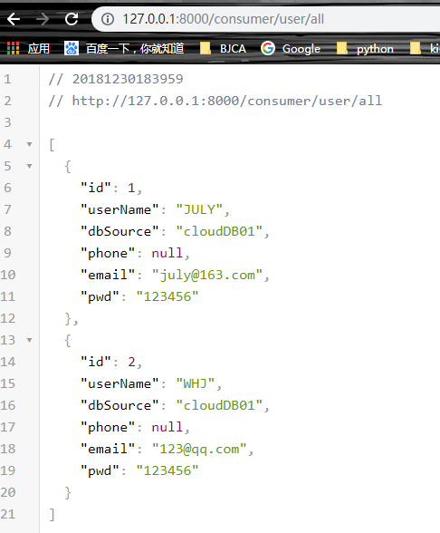

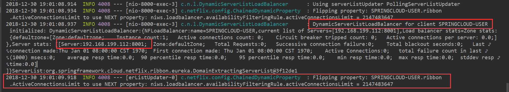

如我们访问成功返回，并在控制台打印Ribbon服务信息，至此：Ribbon配置成功。

#### 3.2、Ribbon负载均衡

##### 3.2.1、架构原理

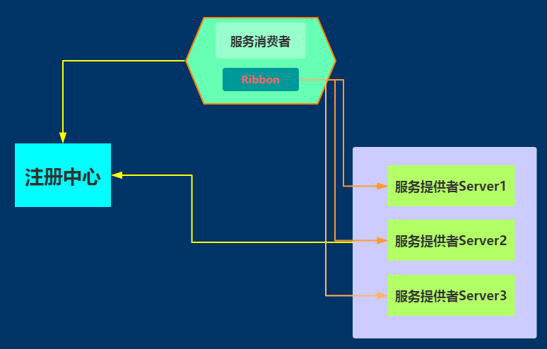

​	Ribbon在工作时分成两步
​	第一步先选择 EurekaServer ,它优先选择在同一个区域内负载较少的server。
​	第二步再根据用户指定的策略，在从server取到的服务注册列表中选择一个地址。
​	其中Ribbon提供了多种策略：比如轮询、随机和根据响应时间加权。

##### 3.2.2、新增服务提供者

新建Module

​	新建服务提供者`springcloud-provider-user-8002`和`springcloud-provider-user-8003` 。**其他内容COPY服务提供者`springcloud-provider-user-8001`**

新建Module名称分别为`springcloud-provider-user-8002`，`springcloud-provider-user-8003`。

**新建数据库**

​	新建两个服务的数据，分别为`cloudDB02,`cloudDB03`。

数据库`cloudDB02`数据库脚本如下：

```sql
DROP DATABASE IF EXISTS cloudDB02;
 
CREATE DATABASE cloudDB02 CHARACTER SET UTF8;
 
USE cloudDB02;

SET NAMES utf8;
SET FOREIGN_KEY_CHECKS = 0;

-- ----------------------------
--  Table structure for `user`
-- ----------------------------
DROP TABLE IF EXISTS `user`;
CREATE TABLE `user` (
  `id` int(11) NOT NULL AUTO_INCREMENT,
  `userName` varchar(50) DEFAULT NULL,
  `dbSource` varchar(50) DEFAULT NULL,
  `phone` varchar(20) DEFAULT NULL,
  `email` varchar(50) DEFAULT NULL,
  `pwd` varchar(50) DEFAULT NULL,
  PRIMARY KEY (`id`)
) ENGINE=InnoDB AUTO_INCREMENT=3 DEFAULT CHARSET=latin1;

-- ----------------------------
--  Records of `user_copy`
-- ----------------------------
BEGIN;
INSERT INTO `user` VALUES ('1', 'JULY', DATABASE(), '18232533234', 'july@163.com', '123456'), ('2', 'WHJ', DATABASE(), '12312312312', '123@qq.com', '123456');
COMMIT;

SET FOREIGN_KEY_CHECKS = 1;
```

数据库`cloudDB03`数据库脚本如下：

```sql
DROP DATABASE IF EXISTS cloudDB03;
 
CREATE DATABASE cloudDB03 CHARACTER SET UTF8;
 
USE cloudDB03;

SET NAMES utf8;
SET FOREIGN_KEY_CHECKS = 0;
-- ----------------------------
--  Table structure for `user`
-- ----------------------------
DROP TABLE IF EXISTS `user`;
CREATE TABLE `user` (
  `id` int(11) NOT NULL AUTO_INCREMENT,
  `userName` varchar(50) DEFAULT NULL,
  `dbSource` varchar(50) DEFAULT NULL,
  `phone` varchar(20) DEFAULT NULL,
  `email` varchar(50) DEFAULT NULL,
  `pwd` varchar(50) DEFAULT NULL,
  PRIMARY KEY (`id`)
) ENGINE=InnoDB AUTO_INCREMENT=3 DEFAULT CHARSET=latin1;

-- ----------------------------
--  Records of `user_copy`
-- ----------------------------
BEGIN;
INSERT INTO `user` VALUES ('1', 'JULY', DATABASE(), '18232533234', 'july@163.com', '123456'), ('2', 'WHJ', DATABASE(), '12312312312', '123@qq.com', '123456');
COMMIT;

SET FOREIGN_KEY_CHECKS = 1;
```

**修改YML文件**

修改微服务`8002` yml文件，主要修改一下内容：

​	1、服务端口号改为 8002

​	2、数据库连接改为连接cloudDB02数据库

​	3、Eureka注册服务名称改成`springcloud-user-8002`

修改后yml文件全部内容：

```yaml
server:
  port: 8002
mybatis:
  type-aliases-package:  cn.org.july.springcloudapi.entities            #所以entity别名类所在路径

spring:
  application:
    name: springcloud-user
  datasource:
    type: com.alibaba.druid.pool.DruidDataSource                        #当前数据源操作类型
    driver-class-name: com.mysql.cj.jdbc.Driver                         #mysql驱动包
    url: jdbc:mysql://127.0.0.1:3306/cloudDB02?useUnicode=true&characterEncoding=utf8&serverTimezone=GMT%2B8&useSSL=false                          #数据库连接
    username: root
    password: root
    dbcp2:
      min-idle: 5                                                       #数据库连接池的最小维持连接数
      initial-size: 5                                                   #初始化连接数
      max-total: 5                                                      #最大连接数
      max-wait-millis: 200                                              #等待连接获取的最大超时时间

eureka:
  client:
    serviceUrl:
      defaultZone: http://eureka7001.com:7001/eureka/,http://eureka7002.com:7002/eureka/,http://eureka7003.com:7003/eureka/
      registerWithEureka: true
      fetchRegistry: true
  instance:
    instance-id: springcloud-user-8002
    prefer-ip-address: true

info:
  app.name: springcloud-user
  company.name: www.july.com
  build.artifactId: springcloud
  build.version: 1.0-SNAPSHOT
```

修改微服务`8003` yml文件，主要修改一下内容：

​	1、服务端口号改为 8003

​	2、数据库连接改为连接cloudDB03数据库

​	3、Eureka注册服务名称改成`springcloud-user-8003`

修改后yml文件全部内容：

```yaml
server:
  port: 8003
mybatis:
  type-aliases-package:  cn.org.july.springcloudapi.entities            #所以entity别名类所在路径

spring:
  application:
    name: springcloud-user
  datasource:
    type: com.alibaba.druid.pool.DruidDataSource                        #当前数据源操作类型
    driver-class-name: com.mysql.cj.jdbc.Driver                         #mysql驱动包
    url: jdbc:mysql://127.0.0.1:3306/cloudDB03?useUnicode=true&characterEncoding=utf8&serverTimezone=GMT%2B8&useSSL=false                          #数据库连接
    username: root
    password: root
    dbcp2:
      min-idle: 5                                                       #数据库连接池的最小维持连接数
      initial-size: 5                                                   #初始化连接数
      max-total: 5                                                      #最大连接数
      max-wait-millis: 200                                              #等待连接获取的最大超时时间

eureka:
  client:
    serviceUrl:
      defaultZone: http://eureka7001.com:7001/eureka/,http://eureka7002.com:7002/eureka/,http://eureka7003.com:7003/eureka/
      registerWithEureka: true
      fetchRegistry: true
  instance:
    instance-id: springcloud-user-8003
    prefer-ip-address: true

info:
  app.name: springcloud-user
  company.name: www.july.com
  build.artifactId: springcloud
  build.version: 1.0-SNAPSHOT
```

注：**`spring.application.name=springcloud-user` 名称一定要相同。**

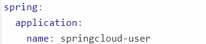

##### 3.2.3、测试

1、启动eureka集群

2、启动三个服务提供者。

​	打开浏览器分别访问 http://127.0.0.1:8001/user/all

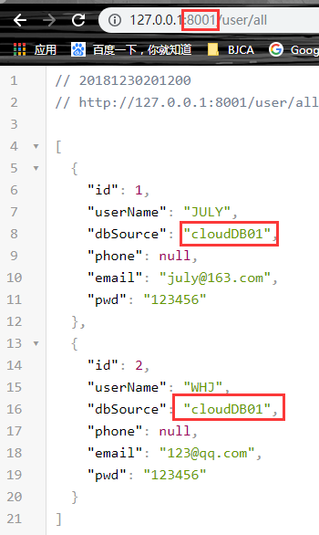

​	打开浏览器分别访问 http://127.0.0.1:8002/user/all

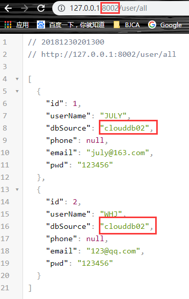

​	打开浏览器分别访问 http://127.0.0.1:8003/user/all

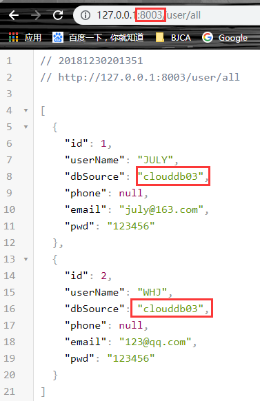

三个服务启动成功。

3、启动消费者服务

​	打开浏览器访问http://127.0.0.1:8000/consumer/user/all

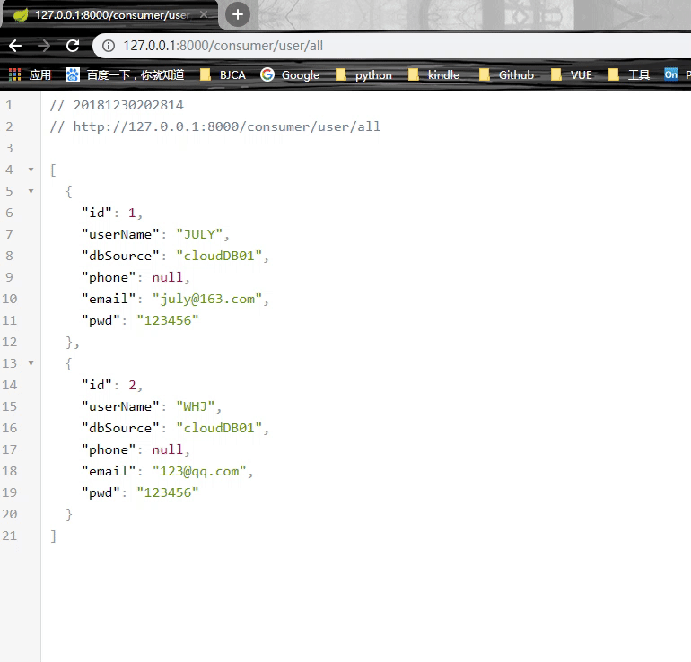

我们可以看到，刷新页面注意观察看到返回的数据库名字，各不相同，负载均衡实现。

#### 3.3、Ribbon核心组件IRule

##### 3.3.1、解析IRule自带的7种算法

| **内置负载均衡规则类**    | **规则描述**                                                 |
| ------------------------- | ------------------------------------------------------------ |
| RoundRobinRule            | 简单轮询服务列表来选择服务器。它是Ribbon默认的负载均衡规则。 |
| AvailabilityFilteringRule | 对以下两种服务器进行忽略：（1）在默认情况下，这台服务器如果3次连接失败，这台服务器就会被设置为“短路”状态。短路状态将持续30秒，如果再次连接失败，短路的持续时间就会几何级地增加。注意：可以通过修改配置loadbalancer.<clientName>.connectionFailureCountThreshold来修改连接失败多少次之后被设置为短路状态。默认是3次。（2）并发数过高的服务器。如果一个服务器的并发连接数过高，配置了AvailabilityFilteringRule规则的客户端也会将其忽略。并发连接数的上线，可以由客户端的<clientName>.<clientConfigNameSpace>.ActiveConnectionsLimit属性进行配置。 |
| WeightedResponseTimeRule  | 为每一个服务器赋予一个权重值。服务器响应时间越长，这个服务器的权重就越小。这个规则会随机选择服务器，这个权重值会影响服务器的选择。 |
| ZoneAvoidanceRule         | 以区域可用的服务器为基础进行服务器的选择。使用Zone对服务器进行分类，这个Zone可以理解为一个机房、一个机架等。 |
| BestAvailableRule         | 忽略哪些短路的服务器，并选择并发数较低的服务器。             |
| RandomRule                | 随机选择一个可用的服务器。                                   |
| RetryRule                 | 重试机制的选择逻辑，先按照RoundRobinRule的策略获取服务，如果获取服务失败则在指定时间内会进行重试，获取可用的服务。 |
|                           |                                                              |

##### 3.3.2、切换负载均衡策略

​	默认的负载均衡策略为轮询测试，修改默认的策略变为随机。

修改`springcloud-consumer-user-80`消费者`ConfigBean` 新增如下内容

```java
@Bean
    public IRule myRule() {
        /**
         * 随机算法获取服务
         */
        return new RandomRule();
    }
```

如需换用其他策略，只需要`new XXX策略()` 即可。

完整的java文件内容如下：

```java
@Configuration
public class ConfigBean {

    @Bean
    @LoadBalanced
    public RestTemplate getRestTemplate() {
        return new RestTemplate();
    }
    @Bean
    public IRule myRule() {
        /**
         * 随机算法获取服务
         */
        return new RandomRule();
    }
}
```

##### 3.3.3、自定义负载均衡策略

​	实现依据权重实在自定义负载均衡策略，规则如下： 服务提供者 8001，8002，8003 按照 2：3：5的权重提供相应的服务。下面我实现代码

```java
/**
 * 服务提供者 按照 2：3：5的权重实现负载均衡策略
 *
 * @author goodboy
 * @date 20181231
 */
public class MyWeightRule implements IRule {

    private ILoadBalancer balancer = new BaseLoadBalancer();
    private static int number = 0;

    @Override
    public Server choose(Object o) {
        List<Server> allServers = balancer.getAllServers();
        number++;
        if (number <= 2) { //当 number=1,2时访问8001服务
            return findServer(allServers, 8001);
        } else if (number <= 5) { //当 number= 3,4,5时访问 8002服务
            return findServer(allServers, 8002);
        }
        if (number == 10) { //当 number = 10 时重置为 0 开始另一轮的轮询
            number = 0;
        }
        return findServer(allServers, 8003); //当number > 5 时访问8003服务
    }

    @Override
    public void setLoadBalancer(ILoadBalancer iLoadBalancer) {
        this.balancer = iLoadBalancer;
    }

    @Override
    public ILoadBalancer getLoadBalancer() {
        return this.balancer;
    }

    private Server findServer(List<Server> allServers, int port) {
        for (Server server : allServers) {
            if (server.getPort() == port) {
                return server;
            }
        }
        return null;
    }
}
```

注：以上方法中number为固定1-10，我们可以使用一下方式来代替

```java
Random random = new Random();
final int number = random.nextInt(10);
```


