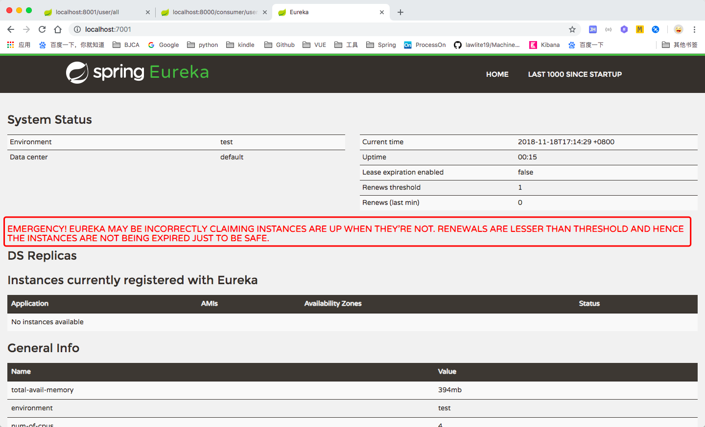

#Spring Cloud 笔记


针对这个架构图我分层介绍一下：

1、是web服务器的选型，这个我选择的是nginx+keepalived，haproxy也是一个选择，但是haproxy在反向代理处理跨域访问的时候问题很多。所以我们nginx有些地方做了keep-alive模式处理，减少了三次握手的次数，提高了连接效率。keepalived做nginx的负载，虚拟一个vip对外，两个nginx做高可用，nginx本身反向代理zuul集群。

2、api gateway，这里的zuul很多人诟病，说是速度慢推荐直接用nginx，这里我还是推荐使用zuul的，毕竟zuul含有拦截器和反向代理，在权限管理、单点登录、用户认证时候还是很有用的，而且zuul自带ribbon负载均衡，如果你直接用nginx，还需要单独做一个feign或者ribbon层，用来做业务集群的负载层，毕竟直接把接口暴露给web服务器太危险了。这里zuul带有ribbon负载均衡和hystrix断路器，直接反向代理serviceId就可以代理整个集群了。

3、业务集群，这一层我有些项目是分两层的，就是上面加了一个负载层，下面是从service开始的，底层只是单纯的接口，controller是单独一层由feign实现，然后内部不同业务服务接口互调，直接调用controller层，只能说效果一般，多了一次tcp连接。所以我推荐合并起来，因为做过spring cloud项目的都知道，feign是含有ribbon的，而zuul也含有ribbon，这样的话zuul调用服务集群，和服务集群间接口的互调都是高可用的，保证了通讯的稳定性。Hystrix还是要有的，没有断路器很难实现服务降级，会出现大量请求发送到不可用的节点。当然service是可以改造的，如果改造成rpc方式，那服务之间互调又是另外一种情况了，那就要做成负载池和接口服务池的形式了，负载池调用接口池，接口池互相rpc调用，feign client只是通过实现接口达到了仿rpc的形式，不过速度表现还是不错的。

4、redis缓存池，这个用来做session共享，**分布式系统session共享是一个大问题**。同时呢，redis做二级缓存对降低整个服务的响应时间，并且减少数据库的访问次数是很有帮助的。当然redis cluster还是redis sentinel自己选择。

5、eurake注册中心这个高可用集群，这里有很多细节，比如多久刷新列表一次，多久监测心跳什么的，都很重要。

6、spring admin，这个是很推荐的，这个功能很强大，可以集成turbine断路器监控器，而且可以定义所有类的log等级，不用单独去配置，还可以查看本地log日志文件，监控不同服务的机器参数及性能，非常强大。它加上elk动态日志收集系统，对于项目运维非常方便。

7、zipkin，这个有两种方式，直接用它自己的功能界面查看方式，或者用stream流的方式，由elk动态日志系统收集。但是我必须要说，这个对系统的性能损害非常大，因为链路追踪的时候会造成响应等待，而且等待时间非常长接近1秒，这在生产环境是不能忍受的，所以生产环境最好关掉，有问题调试的时候再打开。

8、消息队列，这个必须的，**分布式系统不可能所有场景都满足强一致性**，这里只能由消息队列来作为缓冲，这里我用的是Kafka。

9、**分布式事物，我认为这是分布式最困难的**，因为不同的业务集群都对应自己的数据库，互相数据库不是互通的，互相服务调用只能是相互接口，有些甚至是异地的，这样造成的结果就是网络延迟造成的请求等待，网络抖动造成的数据丢失，这些都是很可怕的问题，所以必须要处理分布式事物。我推荐的是利用消息队列，采取二阶段提交协议配合事物补偿机制，具体的实现需要结合业务，这里篇幅有限就不展开说了。

10、config配置中心，这是很有必要的，因为服务太多配置文件太多，没有这个很难运维。这个一般利用消息队列建立一个spring cloud bus，由git存储配置文件，利用bus总线动态更新配置文件信息。

11、实时分布式日志系统，logstash收集本地的log文件流，传输给elasticsearch，logstash有两种方式，1、是每一台机器启动一个logstash服务，读取本地的日志文件，生成流传给elasticsearch。2、logback引入logstash包，然后直接生产json流传给一个中心的logstash服务器，它再传给elasticsearch。elasticsearch再将流传给kibana，动态查看日志，甚至zipkin的流也可以直接传给elasticsearch。这个配合spring admin，一个查看动态日志，一个查看本地日志，同时还能远程管理不同类的日志级别，对集成和运维非常有利。

最后要说说，spring cloud的很多东西都比较精确，比如断路器触发时间、事物补偿时间、http响应时间等，这些都需要好好的设计，而且可以优化的点非常多。比如：http通讯可以使用okhttp，jvm优化，nio模式，数据连接池等等，都可以很大的提高性能。

还有一个docker问题，很多人说不用docker就不算微服务。其实我个人意见，spring cloud本身就是微服务的，只需要jdk环境即可。编写dockerfile也无非是集成jdk、添加jar包、执行jar而已，或者用docker compose，将多个不同服务的image组合run成容器而已。但是带来的问题很多，比如通讯问题、服务器性能损耗问题、容器进程崩溃问题，当然如果你有一套成熟的基于k8s的容器管理平台，这个是没问题的，如果没有可能就要斟酌了。而spring cloud本身就是微服务分布式的架构，所以个人还是推荐直接机器部署的，当然好的DevOps工具将会方便很多。

作者：罗伯特_巴乔 
来源：CSDN 
原文：https://blog.csdn.net/cyc3552637/article/details/80254490 
版权声明：本文为博主原创文章，转载请附上博文链接！


## 开启SpringCloud之旅

### 一、Spring Cloud项目搭建

#### 1、建立父工程

​	首先创建一个父工程，名字为spring cloud打开IDEA（以下编码过程编码工具采用IDEA）。

创建新工程为Spring Cloud。


​	选择下一步


   

   

   引入pom.xml代码如下：

   ```xml
<?xml version="1.0" encoding="UTF-8"?>
<project xmlns="http://maven.apache.org/POM/4.0.0"
         xmlns:xsi="http://www.w3.org/2001/XMLSchema-instance"
         xsi:schemaLocation="http://maven.apache.org/POM/4.0.0 http://maven.apache.org/xsd/maven-4.0.0.xsd">
    <modelVersion>4.0.0</modelVersion>

    <groupId>cn.org.july.springcloud</groupId>
    <artifactId>springcloud</artifactId>
    <version>1.0-SNAPSHOT</version>
    <packaging>pom</packaging>


    <properties>
        <project.version>1.0-SNAPSHOT</project.version>
        <project.build.sourceEncoding>UTF-8</project.build.sourceEncoding>
        <project.reporting.outputEncoding>UTF-8</project.reporting.outputEncoding>
        <java.version>1.8</java.version>
        <lombok.version>1.16.18</lombok.version>
        <log4j.version>1.2.17</log4j.version>
        <junit.version>4.12</junit.version>
        <mysql.version>6.0.6</mysql.version>
        <druid.version>1.1.10</druid.version>
    </properties>

    <dependencyManagement>
        <dependencies>
            <dependency>
                <groupId>org.springframework.cloud</groupId>
                <artifactId>spring-cloud-dependencies</artifactId>
                <version>Finchley.SR2</version>
                <type>pom</type>
                <scope>import</scope>
            </dependency>

            <dependency>
                <groupId>org.springframework.boot</groupId>
                <artifactId>spring-boot-dependencies</artifactId>
                <version>2.0.6.RELEASE</version>
                <type>pom</type>
                <scope>import</scope>
            </dependency>

            <!-- mysql jdbc 驱动 -->
            <dependency>
                <groupId>mysql</groupId>
                <artifactId>mysql-connector-java</artifactId>
                <version>${mysql.version}</version>
            </dependency>
            <dependency>
                <groupId>com.alibaba</groupId>
                <artifactId>druid</artifactId>
                <version>${druid.version}</version>
            </dependency>
            <dependency>
                <groupId>org.mybatis.spring.boot</groupId>
                <artifactId>mybatis-spring-boot-starter</artifactId>
                <version>1.3.2</version>
            </dependency>
            <dependency>
                <groupId>ch.qos.logback</groupId>
                <artifactId>logback-core</artifactId>
                <version>1.2.3</version>
            </dependency>
            <dependency>
                <groupId>junit</groupId>
                <artifactId>junit</artifactId>
                <version>${junit.version}</version>
                <scope>test</scope>
            </dependency>
            <dependency>
                <groupId>log4j</groupId>
                <artifactId>log4j</artifactId>
                <version>${log4j.version}</version>
            </dependency>
        </dependencies>
    </dependencyManagement>

    <build>
        <plugins>
            <plugin>
                <groupId>org.apache.maven.plugins</groupId>
                <artifactId>maven-jar-plugin</artifactId>
            </plugin>
            <plugin>
                <artifactId>maven-site-plugin</artifactId>
                <version>2.3</version>
                <executions>
                    <execution>
                        <id>default-site</id>
                        <phase>site</phase>
                        <goals>
                            <goal>site</goal>
                        </goals>
                    </execution>
                </executions>
            </plugin>
            <plugin>
                <groupId>org.apache.maven.plugins</groupId>
                <artifactId>maven-deploy-plugin</artifactId>
                <version>2.8.2</version>
                <configuration>
                    <skip>true</skip>
                </configuration>
            </plugin>
        </plugins>
    </build>
</project>
   ```

​	该工程为父工程，打包方式为pom.`<packaging>pom</packaging>`

#### 2、建立服务API模块

​		在父工程中，新建`Module`,module名称为`springcloud-api`


​	


​	创建完成后项目结构如下：


​	新建包`cn.org.july.springcloudapi.entities`

​	新建类`User`内容如下：

```java
@AllArgsConstructor
@NoArgsConstructor
@Data
@Accessors(chain = true)
public class User implements Serializable {
    /**
     * 主键
     */
    private Integer id;
    /**
     * 部门名称
     */
    private String userName;
    /**
     * 存储数据库位置（分布式部署可能存在多个数据库）
     */
    private String dbSource;
    /**
     * 电话号
     */
    private Spring phone;
    /**
     * 邮箱
     */
    private String email;
    /**
     * 密码
     */
    private String pwd;

}
```

说明：此次使用lombok插件；官网 https://www.projectlombok.org/

| 注解                                                         | 说明                                                         |
| ------------------------------------------------------------ | ------------------------------------------------------------ |
| @Data                                                        | 在JavaBean或类JavaBean中使用，这个注解包含范围最广，它包含getter、setter、NoArgsConstructor注解，即当使用当前注解时，会自动生成包含的所有方法； |
| @getter                                                      | 在JavaBean或类JavaBean中使用，使用此注解会生成对应的getter方法； |
| @setter                                                      | 在JavaBean或类JavaBean中使用，使用此注解会生成对应的setter方法； |
| @NoArgsConstructor                                           | 在JavaBean或类JavaBean中使用，使用此注解会生成对应的无参构造方法； |
| @AllArgsConstructor                                          | 在JavaBean或类JavaBean中使用，使用此注解会生成对应的有参构造方法； |
| @ToString                                                    | 在JavaBean或类JavaBean中使用，使用此注解会自动重写对应的toStirng方法； |
| @EqualsAndHashCode                                           | 在JavaBean或类JavaBean中使用，使用此注解会自动重写对应的equals方法和hashCode方法； |
| @Slf4j                                                       | 在需要打印日志的类中使用，当项目中使用了slf4j打印日志框架时使用该注解，会简化日志的打印流程，只需调用info方法即可； |
| @Log4j                                                       | 在需要打印日志的类中使用，当项目中使用了log4j打印日志框架时使用该注解，会简化日志的打印流程，只需调用info方法即可； |
| @Accessors(prefix = {"first"}, fluent = true, chain = false) | 与生存的get和set方法有关，prefix与定义属性前缀相同时且接下来的字符大写才生效，可以看源码注释或自行尝试；<br/>fluent是决定生成的get/set方法要不要set/get前缀，chain决定set方法是void类型还是返回this |


项目POM文件内容如下：

```xml
<?xml version="1.0" encoding="UTF-8"?>
<project xmlns="http://maven.apache.org/POM/4.0.0" xmlns:xsi="http://www.w3.org/2001/XMLSchema-instance"
	xsi:schemaLocation="http://maven.apache.org/POM/4.0.0 http://maven.apache.org/xsd/maven-4.0.0.xsd">
	<modelVersion>4.0.0</modelVersion>

	<parent>
		<groupId>cn.org.july.springcloud</groupId>
		<artifactId>springcloud</artifactId>
		<version>1.0-SNAPSHOT</version>
	</parent>

	<artifactId>springcloud-api</artifactId>

	<dependencies>
		<dependency>
			<groupId>org.projectlombok</groupId>
			<artifactId>lombok</artifactId>
			<version>1.16.18</version>
		</dependency>
	</dependencies>
</project>

```

```java
@AllArgsConstructor
@NoArgsConstructor
@Data
@Accessors(chain = true)
public class User implements Serializable {
    /**
     * 主键
     */
    private Integer id;
    /**
     * 部门名称
     */
    private String userName;
    /**
     * 存储数据库位置（分布式部署可能存在多个数据库）
     */
    private String dbSource;
    /**
     * 电话号
     */
    private Spring phone;
    /**
     * 邮箱
     */
    private String email;
    /**
     * 密码
     */
    private String pwd;

}
```


#### 3、建立服务提供者

​		在父工程中，新建`Module`,module名称为`springcloud-provider-user-8001`。

​	创建过程如上，不再截图。

修改该`Module ` pom.xml文件，内容如下：

```xml
<?xml version="1.0" encoding="UTF-8"?>
<project xmlns="http://maven.apache.org/POM/4.0.0"
         xmlns:xsi="http://www.w3.org/2001/XMLSchema-instance"
         xsi:schemaLocation="http://maven.apache.org/POM/4.0.0 http://maven.apache.org/xsd/maven-4.0.0.xsd">
    <parent>
        <artifactId>springcloud</artifactId>
        <groupId>cn.org.july.springcloud</groupId>
        <version>1.0-SNAPSHOT</version>
    </parent>
    <modelVersion>4.0.0</modelVersion>

    <artifactId>springcloud-provider-user-8001</artifactId>
    <dependencies>
        <!-- 引入API -->
        <dependency>
            <groupId>cn.org.july.springcloud</groupId>
            <artifactId>springcloud-api</artifactId>
            <version>${project.version}</version>
        </dependency>
        <!-- 单元测试 -->
        <dependency>
            <groupId>junit</groupId>
            <artifactId>junit</artifactId>
        </dependency>
        <!-- 数据源 -->
        <dependency>
            <groupId>com.alibaba</groupId>
            <artifactId>druid</artifactId>
        </dependency>
        <!-- 数据库驱动-->
        <dependency>
            <groupId>mysql</groupId>
            <artifactId>mysql-connector-java</artifactId>
        </dependency>
        <!-- 日志 -->
        <dependency>
            <groupId>ch.qos.logback</groupId>
            <artifactId>logback-core</artifactId>
        </dependency>
        <!-- springBoot 集成 mybatis-->
        <dependency>
            <groupId>org.mybatis.spring.boot</groupId>
            <artifactId>mybatis-spring-boot-starter</artifactId>
        </dependency>
        <!-- web模块 -->
        <dependency>
            <groupId>org.springframework.boot</groupId>
            <artifactId>spring-boot-starter-web</artifactId>
        </dependency>
        <!-- 单元测试 -->
        <dependency>
            <groupId>org.springframework.boot</groupId>
            <artifactId>spring-boot-starter-test</artifactId>
        </dependency>
    </dependencies>

</project>
```

我们这里主要是讲整体架构搭建，我们不具体实现复杂的业务逻辑。**以下只实现查询接口**。

在新建的Module中建立如下项目结构：


- 新建包路径`cn.org.july.springcloud.dao;cn.org.july.springcloud.service;cn.org.july.springcloud.controller;`。

- 在`resources`目录下创建`application.yml`配置文件。

  ```yaml
  xserver:
    port: 8001
  mybatis:
    type-aliases-package:  cn.org.july.springcloudapi.entities       #所以entity别名类所在路径
  
  spring:
    application:
      name: springcloud-user
    datasource:
      type: com.alibaba.druid.pool.DruidDataSource                   #当前数据源操作类型
      driver-class-name: com.mysql.cj.jdbc.Driver                    #mysql驱动包
      url: jdbc:mysql://127.0.0.1:3306/cloudDB01                     #数据库连接
      username: root
      password: xxxx
      dbcp2:
        min-idle: 5                                                   #数据库连接池的最小维持连接数
        initial-size: 5                                               #初始化连接数
        max-total: 5                                                  #最大连接数
        max-wait-millis: 200                                          #等待连接获取的最大超时时间
  
  ```

  **注意**：

  ```yaml
  spring:
    application:
      name: springcloud-user
  ```

- 新建数据库**cloudDB01**执行以下脚本

  ```sql
  /*
   Navicat MySQL Data Transfer
  
   Source Server         : localhost
   Source Server Type    : MySQL
   Source Server Version : 50719
   Source Host           : localhost
   Source Database       : cloudDB01
  
   Target Server Type    : MySQL
   Target Server Version : 50719
   File Encoding         : utf-8
  
   Date: 11/18/2018 14:19:42 PM
  */
  
  SET NAMES utf8;
  SET FOREIGN_KEY_CHECKS = 0;
  
  -- ----------------------------
  --  Table structure for `user`
  -- ----------------------------
  DROP TABLE IF EXISTS `user`;
  CREATE TABLE `user` (
    `id` int(11) NOT NULL AUTO_INCREMENT,
    `userName` varchar(50) DEFAULT NULL,
    `dbSource` varchar(50) DEFAULT NULL,
    `phone` varchar(20) DEFAULT NULL,
    `email` varchar(50) DEFAULT NULL,
    `pwd` varchar(50) DEFAULT NULL,
    PRIMARY KEY (`id`)
  ) ENGINE=InnoDB AUTO_INCREMENT=3 DEFAULT CHARSET=latin1;
  
  -- ----------------------------
  --  Records of `user_copy`
  -- ----------------------------
  BEGIN;
  INSERT INTO `user` VALUES ('1', 'JULY', 'cloudDB01', '18232533234', 'july@163.com', '123456'), ('2', 'WHJ', 'cloudDB01', '12312312312', '123@qq.com', '123456');
  COMMIT;
  
  SET FOREIGN_KEY_CHECKS = 1;
  ```

- 在dao中新建类：`UserDao`.内容如下：

  ```java
  @Mapper
  public interface UserDao {
  
      @Select("select * from user")
      List<User> findAll();
  
      @Select("select * from user where id = #{id}")
      User findById(Long id);
  
  }
  ```

- 在service中新建类：`UserService`。内容如下：

  ```java
  @Service
  public class UserService {
  
      @Autowired
      private UserDao userDao;
  
      public User findById(Long id) {
          return userDao.findById(id);
      }
  
      public List<User> findAll() {
          return userDao.findAll();
      }
  }
  ```

- 在controller中新建类：`UserController`。内容如下：

  ```java
  @RestController
  @RequestMapping
  public class UserController {
      @Autowired
      private UserService userService;
  
      @RequestMapping(value = "/user/all")
      @ResponseBody
      public List<User> getAllUser(){
          return userService.findAll();
      }
      
      @RequestMapping(value = "/user/{id}")
      @ResponseBody
      public User getUserById(@PathVariable("id") Long id){
          return userService.findById(id);
      }
  }
  
  ```

- 创建服务启动类`Application_provider_8001`。内容如下：

  ```java
  @SpringBootApplication
  @MapperScan(basePackages = "cn.org.july.springcloud")
  public class Application_provider_8001 {
      public static void main(String[] args) {
          SpringApplication.run(Application_provider_8001.class, args);
      }
  }
  ```

- 启动后在浏览器中输入http://localhost:8001/user/all;返回内容如下，说明服务提供者搭建成功。

  


#### 4、创建服务消费者

​	新建`Module`,名称为`springcloud-consumer-user-8000`。

创建过来不在详细讲述；创建完成后，项目结构目录如下：


- 在`springcloud-consumer-user-8000`中，新建包结构，`cn.org.july.springcloud.cfgbean;cn.org.july.springcloud.controller`.

- 在`resources`目录新建`application.yml`配置文件

  ```yaml
  server:
    port: 8000
  ```

  作为服务消费者，只需要指定服务端口即可。

- 在`cn.org.july.springcloud.cfgbean`包创建`ConfigBean`.内容如下：

  ```java
  @Configuration
  public class ConfigBean {
      @Bean
      public RestTemplate getRestTemplate(){
          return new RestTemplate();
      }
  }
  ```

  关于这两个注解，笔者在Spring Boot 中已经详细讲解过，有想了解，提供传送门；https://blog.csdn.net/July_whj/article/details/83449911

  **RestTemplate**： RestTemplate 提供了多种便捷访问远程HTTP服务的方法，是一种简单便捷的访问restful服务模版类，是Spring提供的用于访问Rest服务的客户端模版工具集。详情查看官方网站 https://docs.spring.io/spring/docs/current/javadoc-api/org/springframework/web/client/RestTemplate.html

- 在`controller`中新建`UserController_Consumer`类。（这里命名有点怪。。。）

  ```java
  @RestController
  public class UserController_Consumer {
  	/**
  	 * 服务提供方地址
  	 */
      private static final String url = "http://localhost:8001/";
  
      /**
       * RestTemplate 提供了多种便捷访问远程HTTP服务的方法
       * 是一种简单便捷的访问restful服务模版类，是Spring提供的用于访问
       * Rest服务的客户端模版工具集
       */
      @Autowired
      private RestTemplate restTemplate;
  
      @RequestMapping(value = "/consumer/user/all")
      @ResponseBody
      public List getUserAll() {
          return restTemplate.getForObject(url.concat("user/all"), List.class);
      }
  
      @RequestMapping(value = "/consumer/user/{id}")
      @ResponseBody
      public ResponseEntity<User> getUserById(@PathVariable("id") Long id) {
          return restTemplate.getForEntity(url.concat("user/").concat(id.toString()), User.class);
      }
  
  }
  ```

  这里和服务提供者的区别访问地址新增`consumer`路径。

- 创建服务启动类`Application_consumer_8000`,内容如下：

  ```java
  @SpringBootApplication
  public class Application_consumer_8000 {
      public static void main(String[] args) {
          SpringApplication.run(Application_consumer_8000.class, args);
      }
  }
  ```

- 首先启动服务提供者服务`springcloud-provider-user-8001`,在启动服务消费者`springcloud-consumer-user-8000`.服务启动成功后访问 http://localhost:8000/consumer/user/1；http://localhost:8000/consumer/user/all

  

  

  出现以上结果，服务消费者配置成功。该程序只做简单实例。


#### 5、服务的注册与发现


关系调用说明：

- 服务生产者启动时，向服务注册中心注册自己提供的服务

- 服务消费者启动时，在服务注册中心订阅自己所需要的服务

- 注册中心返回服务提供者的地址信息个消费者

- 消费者从提供者中调用服务


#### 6、启动eureka注册中心

​	Eureka是Spring Cloud Netflix微服务套件中的一部分，可以与Springboot构建的微服务很容易的整合起来。
​	Eureka包含了服务器端和客户端组件。服务器端，也被称作是服务注册中心，用于提供服务的注册与发现。

​	Eureka支持高可用的配置，当集群中有分片出现故障时，Eureka就会转入自动保护模式，它允许分片故障期间继续提供服务的发现和注册，当故障分片恢复正常时，集群中其他分片会把他们的状态再次同步回来。
​	客户端组件包含服务消费者与服务生产者。在应用程序运行时，Eureka客户端向注册中心注册自身提供的服务并周期性的发送心跳来更新它的服务租约。同时也可以从服务端查询当前注册的服务信息并把他们缓存到本地并周期性的刷新服务状态。


- 新创建一个`Module`,命名为`springcloud-eureka-7001`,项目结构如下：

  

- 修改pom.xml文件

  ```xml
  <?xml version="1.0" encoding="UTF-8"?>
  <project xmlns="http://maven.apache.org/POM/4.0.0"
           xmlns:xsi="http://www.w3.org/2001/XMLSchema-instance"
           xsi:schemaLocation="http://maven.apache.org/POM/4.0.0 http://maven.apache.org/xsd/maven-4.0.0.xsd">
      <parent>
          <artifactId>springcloud</artifactId>
          <groupId>cn.org.july.springcloud</groupId>
          <version>1.0-SNAPSHOT</version>
      </parent>
      <modelVersion>4.0.0</modelVersion>
  
      <artifactId>springcloud-eureka-7001</artifactId>
  
      <dependencies>
          <dependency>
              <groupId>org.springframework.boot</groupId>
              <artifactId>spring-boot-starter-web</artifactId>
          </dependency>
          <!--注意：这里是服务注册中心，需要引入eureka的服务端 -->
          <dependency>
              <groupId>org.springframework.cloud</groupId>
              <artifactId>spring-cloud-starter-netflix-eureka-server</artifactId>
          </dependency>
      </dependencies>
  </project>
  ```

- 在`resources`目录下新建`application.yml`,文件，内容如下：

  ```yacas
  server:
    port: 7001
  
  eureka:
    instance:
      hostname: localhost
    client:
      registerWithEureka: false
      fetchRegistry: false
      serviceUrl:
        defaultZone: http://${eureka.instance.hostname}:${server.port}/eureka/
  
  spring:
    application:
      name: eurka-server
  ```

- 创建包`cn.org.july.springcloud.eureka`,创建系统启动类`ApplicationEnreka`，

  ```java
  @SpringBootApplication
  @EnableEurekaServer
  public class ApplicationEnreka {
  
      public static void main(String[] args) {
          SpringApplication.run(ApplicationEnreka.class, args);
      }
  
  }
  ```

  注意：启动类上需标明该类是Eureka服务端。

- 启动后访问http://localhost:7001/ 出现如下页面服务注册中心搭建成功。

  

  **注意**：标注红的的框框是 **No instances available** ，表示没有实例注册到该服务的注册中上。

  

过一段时间，不操作，刷新页面会看到一段红色的描述。这个不是错误，是Eureka的自我保护。后面我们详细讲解。

#### 7、将用户微服务注入Eureka注册中心

##### 7.1、修改用户微服务`springcloud-provider-user-8001` 

- **pom修改**

  在原有pom.xml基础上新增一下内容：

  ```xml
  <!-- 将微服务provider侧注册进eureka -->
  <dependency>
     <groupId>org.springframework.cloud</groupId>
     <artifactId>spring-cloud-starter-netflix-eureka-client</artifactId>
  </dependency>
  ```

  修改后pom.xml全部内容:

  ```xml
  <?xml version="1.0" encoding="UTF-8"?>
  <project xmlns="http://maven.apache.org/POM/4.0.0"
           xmlns:xsi="http://www.w3.org/2001/XMLSchema-instance"
           xsi:schemaLocation="http://maven.apache.org/POM/4.0.0 http://maven.apache.org/xsd/maven-4.0.0.xsd">
      <parent>
          <artifactId>springcloud</artifactId>
          <groupId>cn.org.july.springcloud</groupId>
          <version>1.0-SNAPSHOT</version>
      </parent>
      <modelVersion>4.0.0</modelVersion>
  
      <artifactId>springcloud-provider-user-8001</artifactId>
      <dependencies>
          <!-- 引入API -->
          <dependency>
              <groupId>cn.org.july.springcloud</groupId>
              <artifactId>springcloud-api</artifactId>
              <version>${project.version}</version>
          </dependency>
          <!-- 单元测试 -->
          <dependency>
              <groupId>junit</groupId>
              <artifactId>junit</artifactId>
          </dependency>
          <!-- 数据源 -->
          <dependency>
              <groupId>com.alibaba</groupId>
              <artifactId>druid</artifactId>
          </dependency>
          <!-- 数据库驱动-->
          <dependency>
              <groupId>mysql</groupId>
              <artifactId>mysql-connector-java</artifactId>
          </dependency>
          <!-- 日志 -->
          <dependency>
              <groupId>ch.qos.logback</groupId>
              <artifactId>logback-core</artifactId>
          </dependency>
          <!-- springBoot 集成 mybatis-->
          <dependency>
              <groupId>org.mybatis.spring.boot</groupId>
              <artifactId>mybatis-spring-boot-starter</artifactId>
          </dependency>
          <!-- web模块 -->
          <dependency>
              <groupId>org.springframework.boot</groupId>
              <artifactId>spring-boot-starter-web</artifactId>
          </dependency>
          <!-- 单元测试 -->
          <dependency>
              <groupId>org.springframework.boot</groupId>
              <artifactId>spring-boot-starter-test</artifactId>
          </dependency>
  
          <!-- 将微服务provider侧注册进eureka -->
          <dependency>
              <groupId>org.springframework.cloud</groupId>
              <artifactId>spring-cloud-starter-netflix-eureka-client</artifactId>
          </dependency>
      </dependencies>
  </project>
  ```

- **YML修改**

  在原`application.yml`基础上新增一下内容：

  ```yaml
  eureka:
    client:
      serviceUrl:
        defaultZone: http://localhost:7001/eureka/
        registerWithEureka: true
        fetchRegistry: true
  ```

  修改后全yml文件内容如下：

  ```yaml
  server:
    port: 8001
  mybatis:
    type-aliases-package:  cn.org.july.springcloudapi.entities            #所以entity别名类所在路径
  
  spring:
    application:
      name: springcloud-user
    datasource:
      type: com.alibaba.druid.pool.DruidDataSource                        #当前数据源操作类型
      driver-class-name: com.mysql.cj.jdbc.Driver                         #mysql驱动包
      url: jdbc:mysql://127.0.0.1:3306/cloudDB01?useUnicode=true&characterEncoding=utf8&serverTimezone=GMT%2B8&useSSL=false                          #数据库连接
      username: root
      password: root
      dbcp2:
        min-idle: 5                                                       #数据库连接池的最小维持连接数
        initial-size: 5                                                   #初始化连接数
        max-total: 5                                                      #最大连接数
        max-wait-millis: 200                                              #等待连接获取的最大超时时间
  
  eureka:
    client:
      serviceUrl:
        defaultZone: http://localhost:7001/eureka/
        registerWithEureka: true
        fetchRegistry: true
  
  ```

- 程序启动类Application_provider_8001修改：

  在`Application_provider_8001`类中新增注解`@EnableEurekaClient`,

  修改后信息如下：

  ```java
  @SpringBootApplication
  @EnableEurekaClient //本服务启动后会自动注册进eureka服务中
  @MapperScan(basePackages = "cn.org.july.springcloud")
  public class Application_provider_8001 {
      public static void main(String[] args) {
          SpringApplication.run(Application_provider_8001.class, args);
      }
  }
  ```

  ##### 7.2、测试服务注入

  1、首先启动Eureka服务。

  2、启动用户微服务。

  3、在浏览器中打开http://127.0.0.1:7001.

  

  可以看到，用户微服务注册成功。

  Application 名称对应配置关系如下：

  

  ##### 7.3、问题


